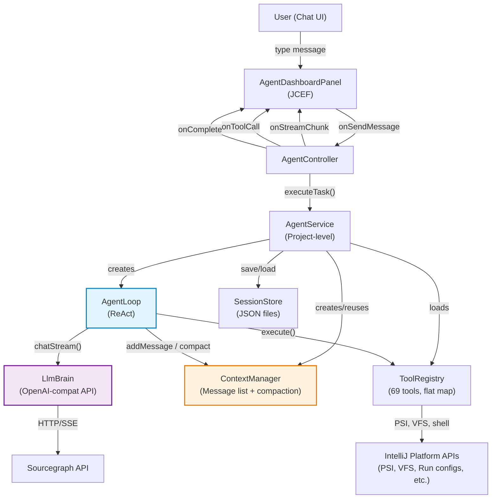
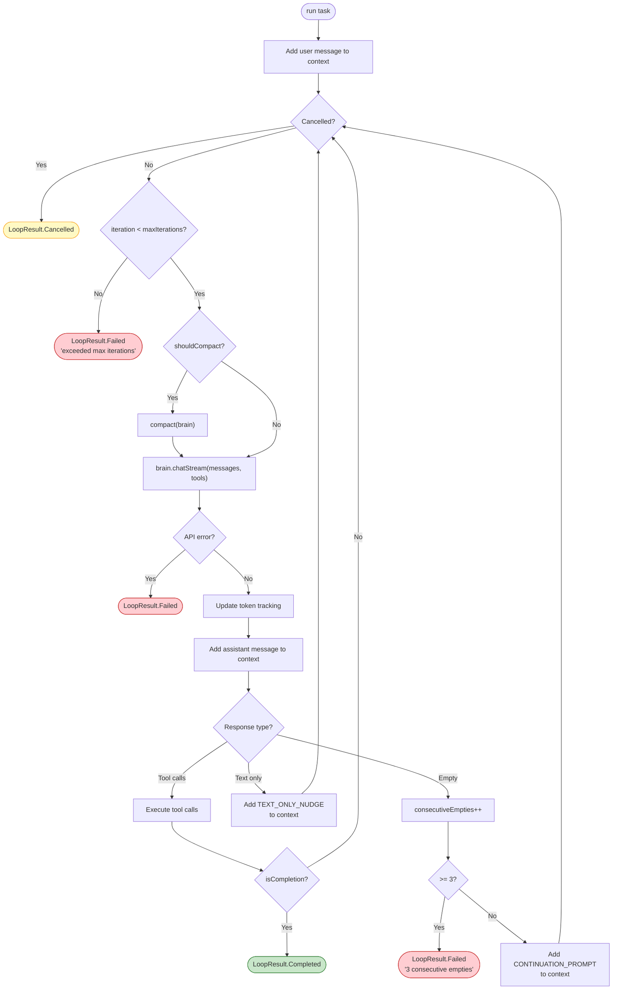
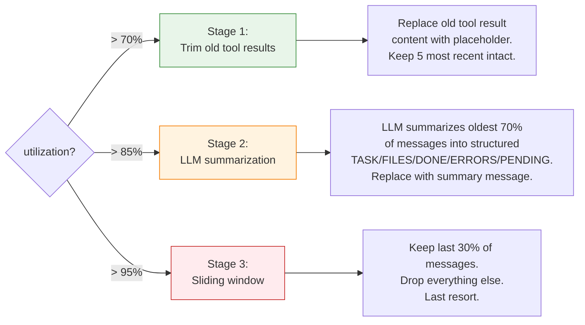
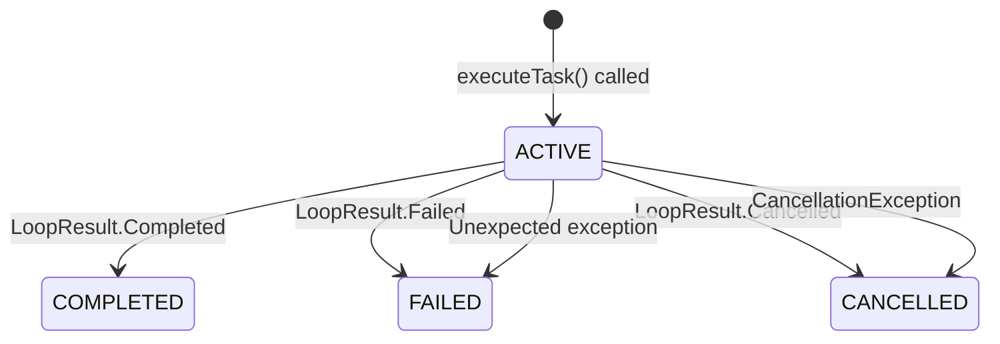

# Agent Module Architecture

## 1. Overview

The `:agent` module is an AI coding agent embedded inside an IntelliJ IDEA plugin. It accepts natural language tasks from a user, reasons about them, takes actions using IDE-integrated tools, and completes the task autonomously -- all within the IDE.

### Design Philosophy

**Simplicity over sophistication.** The previous architecture had 211 files and 48K lines of code spread across 6 gate systems, a 4-stage event-sourced condenser pipeline, an 18-section prompt assembler, 5 layers of tool selection, and sub-agent orchestration. The rewrite reduces this to ~190 files and ~12K LOC by adopting proven patterns from production-grade CLI agents.

The guiding principle: **if Codex CLI, Claude Code, and Cline all converge on a pattern, use that pattern.** Specifically:

- **ReAct loop** -- the industry-standard Reason-Act cycle. Call the LLM, execute tool calls, repeat.
- **Explicit completion** -- the loop exits ONLY when the model calls `attempt_completion`. Text-only responses are not completion; they are nudged back to tool use.
- **Simple message list** -- no event sourcing, no multi-tier budgets. A mutable list of `ChatMessage` objects with byte-based token estimation and 3-stage compaction.
- **Flat tool registry** -- no meta-tools, no action hierarchies, no dynamic schema injection. Every tool is a direct entry in the LLM's tool list.

### Influences

| Pattern | Source |
|---|---|
| ReAct loop structure | Codex CLI, Cline, Claude Code |
| Explicit `attempt_completion` exit | Cline |
| Text-only = nudge, not completion | Cline |
| Empty response recovery with continuation prompts | Codex CLI |
| bytes/4 token estimation | Codex CLI |
| 3-stage compaction (trim, summarize, sliding window) | Codex CLI + Goose hybrid |
| Middle-truncation of tool output | Codex CLI |
| Plan mode via schema filtering | Claude Code |

---

## 2. Component Diagram



### Data Flow Summary

1. **User** types a message in the JCEF chat dashboard.
2. **AgentController** receives the callback and calls `AgentService.executeTask()`.
3. **AgentService** creates (or reuses) a `ContextManager`, builds the system prompt, resolves tools, and launches the `AgentLoop` in a coroutine.
4. **AgentLoop** runs the ReAct cycle: call `LlmBrain.chatStream()`, handle the response, execute tool calls, add results to context, repeat.
5. Streaming text chunks, tool call progress, and the final result flow back through callbacks to the dashboard.

---

## 3. The ReAct Loop (`AgentLoop`)

**File:** `agent/src/main/kotlin/com/workflow/orchestrator/agent/loop/AgentLoop.kt`

### Loop Flow



### Response Type Handling

Every LLM response falls into exactly one of three categories:

| Response Type | Condition | Action | Rationale |
|---|---|---|---|
| **Tool calls** | `toolCalls` is non-empty | Execute each tool call; check for `isCompletion` | Normal agentic operation |
| **Text only** | `content` is non-blank, no tool calls | Inject `TEXT_ONLY_NUDGE` as user message | The model must ACT, not just describe. Follows Cline pattern. |
| **Empty** | No content, no tool calls | Inject `CONTINUATION_PROMPT`; increment empty counter | Recovery mechanism. 3 consecutive empties = failure. |

### The Explicit Completion Pattern

The loop exits successfully **only** when a tool returns `ToolResult(isCompletion = true)`. This is triggered by the `attempt_completion` tool.

```kotlin
// In AgentLoop.executeToolCalls():
if (toolResult.isCompletion) {
    return LoopResult.Completed(
        summary = toolResult.content,
        iterations = iteration,
        tokensUsed = totalTokensUsed,
        verifyCommand = toolResult.verifyCommand
    )
}
```

**Why text-only is NOT completion:** Without explicit completion, the model can produce verbose explanations without actually finishing the task. By requiring `attempt_completion`, the model is forced to declare "I am done" as a deliberate tool call -- the same pattern used by Cline. This prevents premature exits where the model describes what it _would_ do rather than doing it.

The system prompt reinforces this:
```
- When finished, call attempt_completion with a summary
- NEVER respond without calling a tool
```

### Empty Response Recovery

Empty responses happen when the model fails to produce any output -- a known issue with streaming APIs. The recovery mechanism:

1. Inject a continuation prompt: `"Your previous response was empty. Please use the available tools to take action on the task, or call attempt_completion if you are done."`
2. Track consecutive empties with a counter.
3. After 3 consecutive empty responses, fail the loop. This prevents infinite loops where the model is stuck producing nothing.

The counter resets to 0 on any non-empty response.

### Cancellation

Cancellation is cooperative and thread-safe:

```kotlin
private val cancelled = AtomicBoolean(false)

fun cancel() {
    cancelled.set(true)
    brain.cancelActiveRequest()  // Abort in-flight HTTP request
}
```

The `cancelled` flag is checked:
- Before starting the loop
- At the top of each iteration (the `while` condition)
- Before executing each tool call within a single iteration

### Max Iterations Safety Net

The loop enforces a hard cap of 200 iterations (configurable via constructor). This is a safety net against infinite loops, not an expected exit condition. If hit, the result is `LoopResult.Failed` with a descriptive message.

### `LoopResult` (Sealed Class)

**File:** `agent/src/main/kotlin/com/workflow/orchestrator/agent/loop/LoopResult.kt`

```kotlin
sealed class LoopResult {
    data class Completed(
        val summary: String,
        val iterations: Int,
        val tokensUsed: Int = 0,
        val verifyCommand: String? = null
    ) : LoopResult()

    data class Failed(
        val error: String,
        val iterations: Int = 0,
        val tokensUsed: Int = 0
    ) : LoopResult()

    data class Cancelled(
        val iterations: Int,
        val tokensUsed: Int = 0
    ) : LoopResult()
}
```

Every loop exit produces exactly one of these three variants. The `ToolCallProgress` data class is also defined here for streaming tool call status to the UI.

---

## 4. Context Management (`ContextManager`)

**File:** `agent/src/main/kotlin/com/workflow/orchestrator/agent/loop/ContextManager.kt`

### Architecture

The context manager is a **simple mutable list of `ChatMessage` objects** with token tracking and compaction. No event sourcing, no message typing, no condensation pipeline.

```
systemPrompt: ChatMessage?          -- single system message, set once
messages: MutableList<ChatMessage>   -- all conversation messages in order
lastPromptTokens: Int?               -- last API-reported prompt token count
```

`getMessages()` returns `[systemPrompt] + messages` as a single list sent to the LLM.

### Token Tracking

Two strategies, preferring the authoritative source:

| Strategy | Source | Accuracy |
|---|---|---|
| **API-reported** | `response.usage.promptTokens` from each LLM call | Exact |
| **bytes/4 estimate** | Sum of UTF-8 byte lengths / 4 | ~80% accurate (Codex CLI pattern) |

The API-reported value is used when available; the bytes/4 estimate is the fallback for the first call (before any API response) or if usage data is missing.

```kotlin
fun utilizationPercent(): Double {
    val tokens = lastPromptTokens ?: tokenEstimate()
    return (tokens.toDouble() / maxInputTokens) * 100.0
}
```

### 3-Stage Compaction Pipeline

Compaction triggers when utilization exceeds the threshold (default: 85%). The `compact()` method runs through three stages in order, each triggered by its own utilization threshold:



**Stage 1 -- Trim old tool results (>70% utilization)**

Replaces the content of old tool result messages with a placeholder like `[Result trimmed -- was 12345 chars]`. Keeps the 5 most recent tool results intact. This is cheap (no LLM call) and targets the highest-volume content in the context.

**Stage 2 -- LLM summarization (>85% utilization)**

Takes the oldest 70% of messages and asks the LLM to summarize them into a structured format:

```
TASK: <what the user asked for>
FILES: <files read or modified>
DONE: <what has been completed>
ERRORS: <any errors encountered>
PENDING: <what still needs to be done>
```

The summarized messages are replaced with a single `[Context Summary]` user message. Uses `brain.chat()` with `maxTokens = 1024` to keep the summary concise.

**Stage 3 -- Sliding window (>95% utilization)**

Last resort. Keeps the most recent 30% of messages and drops everything else. This is destructive but prevents context overflow.

### Comparison with Deleted System

The old architecture had a 4-stage event-sourced condenser pipeline with:
- Event sourcing with typed message events
- Multi-tier budget system (OK/COMPRESS/NUDGE/CRITICAL/TERMINATE)
- Summary chaining (summaries of summaries)
- Stuck detection heuristics
- Compression-proof anchor messages
- A separate `CondensationPipeline` class with 6 stages

The new system replaces all of that with ~195 lines of straightforward code that covers the same core need: keep the context within the token budget.

---

## 5. System Prompt (`SystemPrompt`)

**File:** `agent/src/main/kotlin/com/workflow/orchestrator/agent/prompt/SystemPrompt.kt`

### Structure

The system prompt is built by a single `build()` function (~57 lines) that replaces a 605-LOC `PromptAssembler` with 18 sections. The prompt contains:

| Section | Content | Condition |
|---|---|---|
| **Role** | "You are an AI coding agent working inside an IDE on project '{name}'." | Always |
| **Project path** | Absolute path to the project root | Always |
| **Repository structure** | Tree of files/directories (repo map) | If `repoMap` is provided |
| **Additional context** | CLAUDE.md or other injected context | If `additionalContext` is provided |
| **Rules** | 7 behavioral instructions (read before edit, verify changes, keep working, fix errors, explain briefly, call attempt_completion, never respond without a tool) | Always |
| **Plan mode** | Read-only constraint: no edits, no creates, no state-modifying commands | If `planModeEnabled` is true |

### Why Minimal

The old prompt had 18 sections including tool selection hints, worker role definitions, context anchors, skill injections, and compression-proof markers. Research from Anthropic and OpenAI shows that shorter, clearer prompts outperform verbose ones -- the model follows 7 clear rules better than 50 nuanced ones. The critical behavioral rules (explicit completion, always use tools) are both in the prompt AND enforced mechanically by the loop.

### Plan Mode

When plan mode is active, the system prompt adds a read-only constraint section. This is reinforced by schema filtering in `AgentService` (write tools are removed from the tool list sent to the LLM).

---

## 6. Tool Architecture

### `AgentTool` Interface

**File:** `agent/src/main/kotlin/com/workflow/orchestrator/agent/tools/AgentTool.kt`

```kotlin
interface AgentTool {
    val name: String
    val description: String
    val parameters: FunctionParameters
    val allowedWorkers: Set<WorkerType>

    suspend fun execute(params: JsonObject, project: Project): ToolResult
    fun toToolDefinition(): ToolDefinition
}
```

Every tool is a single class implementing this interface. No meta-tools, no action dispatching, no dynamic schema generation. The `toToolDefinition()` method converts the tool into the OpenAI function-calling schema format for the LLM.

### `ToolResult`

```kotlin
data class ToolResult(
    val content: String,        // Full content returned to LLM
    val summary: String,        // Short summary for UI/logging
    val tokenEstimate: Int,     // Estimated token cost
    val artifacts: List<String> = emptyList(),
    val isError: Boolean = false,
    val isCompletion: Boolean = false,      // Signals loop exit
    val verifyCommand: String? = null       // Optional verification command
)
```

The `isCompletion` flag is the mechanism that drives the explicit completion pattern. Only `AttemptCompletionTool` sets this to `true`.

### Output Truncation

Tool outputs are middle-truncated before being added to context:

```kotlin
fun truncateOutput(content: String, maxChars: Int = 50_000): String {
    if (content.length <= maxChars) return content
    val headChars = (maxChars * 0.6).toInt()   // Keep first 60%
    val tailChars = maxChars - headChars - 200  // Keep last ~40%
    return content.take(headChars) +
        "\n\n[... $omitted characters omitted ...]\n\n" +
        content.takeLast(tailChars)
}
```

Middle-truncation preserves both the beginning (context, headers) and end (results, errors) of large outputs -- the same strategy used by Codex CLI.

### `ToolRegistry`

**File:** `agent/src/main/kotlin/com/workflow/orchestrator/agent/tools/ToolRegistry.kt`

A flat `Map<String, AgentTool>`. No hierarchy, no categories at runtime, no dynamic resolution.

```kotlin
class ToolRegistry {
    private val tools = mutableMapOf<String, AgentTool>()

    fun register(tool: AgentTool)
    fun getTool(name: String): AgentTool?
    fun getToolsForWorker(workerType: WorkerType): List<AgentTool>
    fun allTools(): Collection<AgentTool>
}
```

### Tool Categories (69 Tools Total)

All tools are registered in `AgentService.registerAllTools()`. The categories are organizational -- the registry itself is flat.

| Category | Count | Tools |
|---|---|---|
| **Builtin** | 15 | `read_file`, `edit_file`, `create_file`, `search_code`, `glob_files`, `run_command`, `kill_process`, `send_stdin`, `revert_file`, `attempt_completion`, `think`, `ask_questions`, `ask_user_input`, `project_context`, `current_time` |
| **VCS** | 12 | `git`, `git_status`, `git_diff`, `git_log`, `git_branches`, `git_blame`, `git_show_commit`, `git_show_file`, `git_stash_list`, `git_file_history`, `git_merge_base`, `changelist_shelve` |
| **PSI / Code Intelligence** | 13 | `find_definition`, `find_references`, `find_implementations`, `file_structure`, `type_hierarchy`, `call_hierarchy`, `type_inference`, `data_flow_analysis`, `get_method_body`, `get_annotations`, `test_finder`, `structural_search`, `read_write_access` |
| **IDE** | 7 | `format_code`, `optimize_imports`, `refactor_rename`, `semantic_diagnostics`, `run_inspections`, `problem_view`, `list_quick_fixes` |
| **Database** | 3 | `db_list_profiles`, `db_query`, `db_schema` |
| **Framework** | 2 | `build`, `spring` |
| **Run Config** | 3 | `create_run_config`, `modify_run_config`, `delete_run_config` |
| **Integration** | 7 | `jira`, `bamboo_builds`, `bamboo_plans`, `bitbucket_pr`, `bitbucket_repo`, `bitbucket_review`, `sonar` |
| **Runtime** | 3 | `runtime_exec`, `runtime_config`, `coverage` |
| **Debug** | 3 | `debug_step`, `debug_inspect`, `debug_breakpoints` |
| **Total** | **69** | |

### Plan Mode Schema Filtering

When plan mode is active, `AgentService` filters write tools out of the tool definitions list before passing it to `AgentLoop`:

```kotlin
private val writeToolNames = setOf(
    "edit_file", "create_file", "run_command", "revert_file",
    "kill_process", "send_stdin", "format_code", "optimize_imports",
    "refactor_rename"
)

val toolDefs = if (planModeActive.get()) {
    tools.values
        .filter { it.name !in writeToolNames }
        .map { it.toToolDefinition() }
} else {
    tools.values.map { it.toToolDefinition() }
}
```

The tools are removed from the schema entirely -- the LLM never sees them in plan mode. This is the same pattern used by Claude Code.

---

## 7. Session Management

### `Session` Data Class

**File:** `agent/src/main/kotlin/com/workflow/orchestrator/agent/session/Session.kt`

```kotlin
@Serializable
data class Session(
    val id: String,
    val title: String = "",
    val createdAt: Long = System.currentTimeMillis(),
    var lastMessageAt: Long = createdAt,
    var messageCount: Int = 0,
    var status: SessionStatus = SessionStatus.ACTIVE,
    var totalTokens: Int = 0
)

@Serializable
enum class SessionStatus { ACTIVE, COMPLETED, FAILED, CANCELLED }
```

Sessions track metadata only -- they do not store conversation messages. The `ContextManager` holds the live conversation; sessions record status and stats.

### `SessionStore`

**File:** `agent/src/main/kotlin/com/workflow/orchestrator/agent/session/SessionStore.kt`

JSON file persistence. One file per session stored at `{agentDir}/sessions/{sessionId}.json`.

```kotlin
class SessionStore(private val baseDir: File) {
    fun save(session: Session)         // Write JSON to disk
    fun load(sessionId: String): Session?  // Read single session
    fun list(): List<Session>          // List all, sorted by createdAt desc
}
```

Uses `kotlinx.serialization` with `prettyPrint = true`. Load failures (corrupt JSON) return `null` gracefully.

### Session Lifecycle



### Multi-Turn Conversations

Multi-turn is achieved by reusing the same `ContextManager` across calls. The `AgentController` holds a single `contextManager` field:

```kotlin
// AgentController.executeTask():
if (contextManager == null) {
    contextManager = ContextManager(maxInputTokens = settings.state.maxInputTokens)
    dashboard.startSession(task)
}
```

First message creates a new `ContextManager` and starts a session. Subsequent messages reuse it -- the new user message is appended to the existing conversation history. `newChat()` resets `contextManager` to `null`.

---

## 8. Threading Model

### Coroutine Scope

`AgentService` owns a `CoroutineScope` tied to the project lifecycle:

```kotlin
private val scope = CoroutineScope(SupervisorJob() + Dispatchers.Default)
```

- `SupervisorJob` ensures a single task failure does not cancel the scope.
- `Dispatchers.Default` is used for the loop (CPU-bound decisions). The `LlmBrain` internally uses `Dispatchers.IO` for HTTP calls.

### EDT Dispatching

All UI updates go through `invokeLater` in the `AgentController`:

```kotlin
private fun onStreamChunk(chunk: String) {
    invokeLater { dashboard.appendStreamToken(chunk) }
}

private fun onToolCall(progress: ToolCallProgress) {
    invokeLater { dashboard.appendToolCall(...) }
}

private fun onComplete(result: LoopResult) {
    invokeLater { /* update dashboard, unlock input */ }
}
```

This ensures no Swing/AWT thread violations. The agent loop itself never touches the EDT.

### Cancellation Propagation

Cancellation flows through two mechanisms:

1. **AtomicBoolean flag** -- `AgentLoop.cancelled` is checked at the top of each iteration and before each tool execution. This provides immediate responsiveness.
2. **Coroutine cancellation** -- `AgentService.cancelCurrentTask()` cancels both the loop (`currentLoop?.cancel()`) and the coroutine job (`currentJob?.cancel()`). The job cancellation triggers `CancellationException` which is caught and converted to `LoopResult.Cancelled`.

```kotlin
fun cancelCurrentTask() {
    currentLoop?.cancel()     // Sets AtomicBoolean + aborts HTTP
    currentJob?.cancel()      // Coroutine-level cancellation
}
```

### Disposal

`AgentService` implements `Disposable` and cleans up on project close:

```kotlin
override fun dispose() {
    cancelCurrentTask()
    scope.cancel("AgentService disposed")
    ProcessRegistry.killAll()
    debugController?.dispose()
}
```

---

## 9. What Was Deleted (and Why)

| Deleted System | Files/LOC | Why Deleted |
|---|---|---|
| **Event-sourced context** (ContextEvent, ConversationHistory, EventStore) | ~15 files / ~3K LOC | Replaced by a mutable list. Event sourcing adds complexity without benefit when context is ephemeral and never replayed. |
| **4-stage condenser pipeline** (CondensationPipeline, 5 condenser classes) | ~8 files / ~2K LOC | Replaced by 3-stage compaction in `ContextManager`. Simpler, same effect. |
| **Multi-tier budget system** (OK/COMPRESS/NUDGE/CRITICAL/TERMINATE) | ~3 files / ~500 LOC | Replaced by a single `compactionThreshold` double. One threshold is sufficient. |
| **6 gate systems** (ApprovalGate, SafetyGate, RateLimitGate, etc.) | ~12 files / ~2K LOC | Over-engineering. The LLM API handles rate limiting; approval is a UI concern; safety is handled by plan mode schema filtering. |
| **18-section PromptAssembler** | 1 file / ~605 LOC | Replaced by `SystemPrompt.build()` at ~57 lines. Most sections were unnecessary or counterproductive (verbose prompts hurt model performance). |
| **5 layers of tool selection** (ToolSelector, ToolRanker, ToolFilter, etc.) | ~10 files / ~2K LOC | Replaced by a flat `ToolRegistry`. The LLM selects tools -- we do not need to pre-select for it. |
| **Sub-agent orchestration** (SubAgentSpawner, WorkerPool, file ownership) | ~20 files / ~5K LOC | Removed entirely. Single agent is sufficient for the use case. Sub-agents add coordination complexity without proportional benefit for IDE tasks. |
| **Ralph Loop self-improvement** | ~5 files / ~1K LOC | Deferred. Self-improvement is a feature that can be added later without architectural changes. |
| **3-tier memory** (core memory, archival, working) | ~8 files / ~2K LOC | Deferred. Session-scoped context is sufficient for v1. Persistent memory can be added as a tool. |
| **Compression-proof anchors** | ~3 files / ~500 LOC | Unnecessary with simpler compaction. The structured summary format preserves key information without special anchor messages. |

---

## 10. Key Design Decisions

| Decision | Alternative Considered | Rationale |
|---|---|---|
| **Single ReAct loop, no sub-agents** | Multi-agent with delegation | Sub-agents add coordination complexity. Industry data shows single-agent with good tools outperforms multi-agent for IDE-scoped tasks. Can add later if needed. |
| **Explicit completion via `attempt_completion`** | Text-only = done (the GPT default) | Prevents premature exits. The model must declare completion as a deliberate action, not by accident of producing text without tool calls. |
| **Text-only = nudge, not completion** | Treat as partial answer | Forces the model to take action. Without this, models produce verbose plans instead of executing them. |
| **3 consecutive empties = failure** | Infinite retry, or 1 = failure | Balances recovery (transient API glitches) with failure detection (stuck model). 3 is the industry standard (Codex CLI, Cline). |
| **bytes/4 token estimation** | Tiktoken library, or no estimation | Tiktoken adds a dependency and initialization cost. bytes/4 is ~80% accurate and trivial to compute. API-reported tokens are used when available. |
| **3-stage compaction, not 4+** | Full condenser pipeline, or no compaction | 3 stages cover all scenarios: cheap trim (most common), LLM summary (when trim is not enough), sliding window (emergency). Adding more stages increases complexity without measurable benefit. |
| **Flat tool registry, no meta-tools** | Meta-tools with action dispatch (old architecture) | Meta-tools add indirection that confuses the model. A flat list of 69 tools is within the comfortable range for modern LLMs. Direct tool calls are more reliable than multi-step action dispatch. |
| **Plan mode via schema filtering** | Runtime guard only, or prompt-only | Schema filtering (removing tools before the LLM call) is the strongest enforcement. The LLM cannot call tools it does not see. Prompt-only enforcement is unreliable. |
| **JSON file persistence for sessions** | SQLite, or in-memory only | JSON files are simple, human-readable, and debuggable. Session data is small and infrequently accessed. No need for a database. |
| **`SupervisorJob` coroutine scope** | Plain `Job` | `SupervisorJob` prevents one failed task from canceling the entire scope. Essential for a long-lived service that may handle multiple task lifecycles. |

---

## 11. Comparison with Industry Tools

| Aspect | This Implementation | Codex CLI | Claude Code | Cline | Old Architecture |
|---|---|---|---|---|---|
| **Loop type** | Single ReAct | Single ReAct | Single ReAct | Single ReAct | ReAct + sub-agents |
| **Completion signal** | `attempt_completion` tool | Explicit completion tool | Text = done (with nudging) | `attempt_completion` tool | Completion tool + gate approval |
| **Text-only handling** | Nudge to use tools | Nudge to use tools | Treated as response | Nudge to use tools | Multi-layer gate evaluation |
| **Empty response** | 3-strike continuation | Continuation prompt | Server-side retry | Continuation prompt | Event-sourced recovery + stuck detection |
| **Token tracking** | API-reported + bytes/4 | bytes/4 (primary) | Server-side | API-reported | Event-sourced tracking + 5-tier budget |
| **Compaction** | 3-stage (trim/summarize/window) | 2-stage (summarize/truncate) | Server-side compaction API | LLM summary + new_task handoff | 4-stage condenser pipeline + anchors |
| **Tool count** | 69 (flat) | ~15 (flat) | ~15 (flat) | ~20 (flat) | 68 tools via 9 meta-tools + 144 actions |
| **Tool dispatch** | Direct (name -> tool) | Direct | Direct | Direct | Meta-tool -> action -> handler |
| **Plan mode** | Schema filtering | N/A | Schema filtering | N/A | Schema filtering + execution guard |
| **Sub-agents** | None | spawn_agent/wait_agent | Agent tool (fork) | use_subagents (read-only) | Full orchestration with file ownership |
| **Memory** | Session-scoped only | Encrypted server-side | Server-side | Session + new_task handoff | 3-tier (core/archival/working) |
| **System prompt** | ~57 lines, 7 rules | ~200 lines | ~500 lines | ~300 lines | 18 sections, ~605 LOC assembler |
| **Total LOC** | ~12K | ~8K (Rust) | N/A (closed) | ~15K (TS) | ~48K |

---

## 12. Future Improvements

These are features that could be added later without requiring architectural changes to the core loop:

| Improvement | Complexity | Description |
|---|---|---|
| **Persistent memory tool** | Low | Add a `memory_store` / `memory_read` tool that persists key-value pairs across sessions. No changes to the loop or context manager needed. |
| **Repo map generation** | Low | Pass a file tree or dependency graph as the `repoMap` parameter in `SystemPrompt.build()`. Already wired, just needs the generator. |
| **CLAUDE.md injection** | Low | Read the project's `CLAUDE.md` and pass it as `additionalContext` to the system prompt. Already wired. |
| **Streaming tool progress** | Low | Use the existing `onToolCall` callback to show real-time progress for long-running tools (builds, test runs). |
| **Verification step** | Medium | After `attempt_completion`, optionally run the `verifyCommand` and re-enter the loop if verification fails. The `LoopResult.Completed` already carries `verifyCommand`. |
| **Sub-agent delegation** | Medium | Add a `delegate_task` tool that spawns a new `AgentLoop` with a scoped `ContextManager`. No changes to the core loop needed. |
| **Session history UI** | Medium | Use `SessionStore.list()` to show past sessions in the chat sidebar. Session metadata is already persisted. |
| **Token budget nudging** | Low | When utilization exceeds a threshold (e.g., 80%), inject a user message asking the model to wrap up. A one-line addition to the loop. |
| **Prompt caching** | Low | Keep the system prompt and initial context in a stable prefix for LLM prompt caching (45-80% cost savings). Requires no structural changes. |
| **Ralph Loop** | Medium | Periodic self-assessment and skill re-injection. Add as a post-iteration hook in the loop. The callback wiring is already stubbed in `AgentController`. |

---

## File Reference

| Component | File |
|---|---|
| ReAct loop | `agent/src/main/kotlin/com/workflow/orchestrator/agent/loop/AgentLoop.kt` |
| Context management | `agent/src/main/kotlin/com/workflow/orchestrator/agent/loop/ContextManager.kt` |
| Loop result types | `agent/src/main/kotlin/com/workflow/orchestrator/agent/loop/LoopResult.kt` |
| System prompt | `agent/src/main/kotlin/com/workflow/orchestrator/agent/prompt/SystemPrompt.kt` |
| Session model | `agent/src/main/kotlin/com/workflow/orchestrator/agent/session/Session.kt` |
| Session persistence | `agent/src/main/kotlin/com/workflow/orchestrator/agent/session/SessionStore.kt` |
| Central service | `agent/src/main/kotlin/com/workflow/orchestrator/agent/AgentService.kt` |
| UI controller | `agent/src/main/kotlin/com/workflow/orchestrator/agent/ui/AgentController.kt` |
| Tool interface | `agent/src/main/kotlin/com/workflow/orchestrator/agent/tools/AgentTool.kt` |
| Tool registry | `agent/src/main/kotlin/com/workflow/orchestrator/agent/tools/ToolRegistry.kt` |
