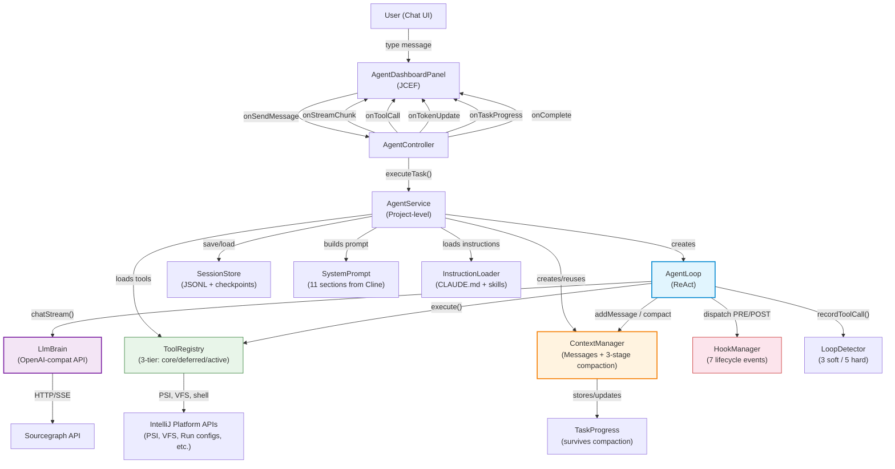
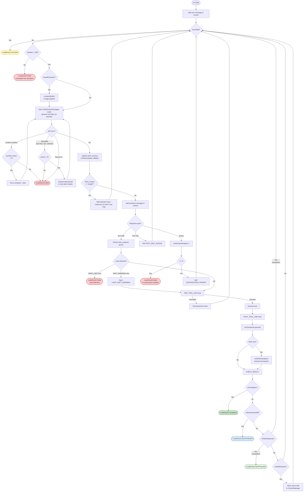
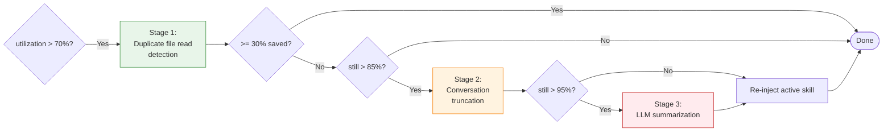
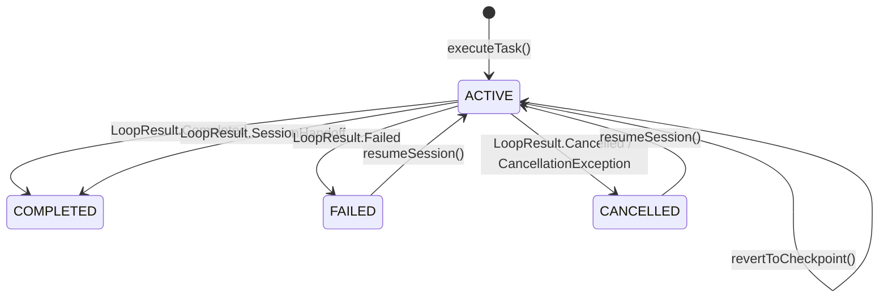

# Agent Module Architecture

## 1. Overview

The `:agent` module is an AI coding agent embedded inside an IntelliJ IDEA plugin. It accepts natural language tasks from a user, reasons about them, takes actions using IDE-integrated tools, and completes the task autonomously -- all within the IDE.

### Design Origin

**Architecture faithfully ported from [Cline](https://github.com/cline/cline)** (VS Code extension), adapted for:

| Cline (source) | Our adaptation |
|---|---|
| TypeScript | Kotlin |
| VS Code extension API | IntelliJ Platform APIs (PSI, VFS, run configs, etc.) |
| XML tool tags in prompts | OpenAI-compatible function calling |
| Anthropic API (direct) | Sourcegraph API (OpenAI-compatible gateway) |
| browser_action tool | Removed (not applicable in IDE context) |
| MCP (Model Context Protocol) | Native tool integrations via `:core` service interfaces |

The sub-agent tool (`spawn_agent`) is inspired by Claude Code's observable behavior (delegation-as-tool, scoped context).

### Key Patterns

| Pattern | Origin |
|---|---|
| 11-section system prompt | Cline (generic variant template) |
| ReAct loop with `attempt_completion` exit | Cline |
| Text-only = nudge, not completion | Cline |
| Empty response recovery (3-strike) | Codex CLI + Cline |
| Loop detection (3 soft / 5 hard) | Cline (`loop-detection.ts`) |
| 3-stage compaction (dedup, truncate, summarize) | Cline + our addition (Stage 3 LLM summarization) |
| Task progress via `task_progress` param | Cline (`FocusChainManager`) |
| Plan mode with `plan_mode_respond` / `act_mode_respond` | Cline |
| Skill system with `use_skill` | Cline (`skills.ts`) |
| Session handoff via `new_task` | Cline |
| Hook system (7 lifecycle events) | Cline (`hook-factory.ts`, `hook-executor.ts`) |
| Checkpoint reversion after write operations | Cline (`context-management`) |
| 3-tier tool registry (core/deferred/active) | Claude Code (observable ToolSearch pattern) |
| bytes/4 token estimation | Codex CLI |
| Middle-truncation of tool output (60/40 split) | Codex CLI |
| Cost tracking (inputTokens/outputTokens) | Cline (`HistoryItem.tokensIn/tokensOut`) |
| Diff generation for file edits | Cline (`DiffViewProvider`) |

---

## 2. Component Diagram



### Data Flow Summary

1. **User** types a message in the JCEF chat dashboard.
2. **AgentController** receives the callback, fires `USER_PROMPT_SUBMIT` hook, then calls `AgentService.executeTask()`.
3. **AgentService** fires `TASK_START` hook, creates (or reuses) a `ContextManager`, builds the 11-section system prompt via `SystemPrompt.build()` with `InstructionLoader` content, resolves tools from `ToolRegistry`, and launches the `AgentLoop` in a coroutine.
4. **AgentLoop** runs the ReAct cycle: call `LlmBrain.chatStream()`, handle the response, execute tool calls (with `PRE_TOOL_USE`/`POST_TOOL_USE` hooks), add results to context, fire `onCheckpoint` to persist, repeat.
5. Streaming text chunks, tool call progress, token updates, task progress, and the final `LoopResult` flow back through callbacks to the dashboard.

---

## 3. The ReAct Loop (`AgentLoop`)

**File:** `agent/src/main/kotlin/com/workflow/orchestrator/agent/loop/AgentLoop.kt`

### Loop Flow



### Response Type Handling

| Response Type | Condition | Action | Source |
|---|---|---|---|
| **Tool calls** | `toolCalls` non-empty | Execute each; check for completion/handoff/plan | Cline |
| **Text only** | `content` non-blank, no tool calls | Inject `TEXT_ONLY_NUDGE` | Cline |
| **Empty** | No content, no tool calls | Inject `CONTINUATION_PROMPT`; 3-strike | Codex CLI + Cline |
| **Truncated** | `finish_reason == "length"` | Add truncated content + "continue from where you left off" | Our addition |

### Completion: `attempt_completion` (Cline Pattern)

The loop exits successfully **only** when a tool returns `ToolResult(isCompletion = true)`. This is triggered exclusively by the `attempt_completion` tool. Text-only responses are never treated as completion -- the model must explicitly declare "I am done" as a deliberate tool call.

### Plan Mode: `plan_mode_respond` -> PlanPresented

When in plan mode and the LLM calls `plan_mode_respond`:
- If `needsMoreExploration = true`: loop continues (LLM will use more read/search tools)
- If `needsMoreExploration = false`: loop returns `LoopResult.PlanPresented`, pausing for user review

### Session Handoff: `new_task` -> SessionHandoff

When context is exhausted beyond compaction's ability to recover, the LLM calls `new_task` with a structured summary. The loop returns `LoopResult.SessionHandoff`, and `AgentService` starts a fresh session with the handoff context.

### Loop Detection (from Cline)

`LoopDetector` tracks consecutive identical tool calls (same name + canonical argument signature, ignoring `task_progress`):
- **3 consecutive** (soft): inject `LOOP_SOFT_WARNING` into context, continue execution
- **5 consecutive** (hard): return `LoopResult.Failed` immediately

### API Retry

Exponential backoff with rate-limit header parsing:
- Retryable errors: `RATE_LIMITED`, `SERVER_ERROR`, `NETWORK_ERROR`, `TIMEOUT`
- Up to 5 retries with exponential backoff (1s, 2s, 4s, 8s, 16s)
- Honors `Retry-After` header when present, capped at 30s

### Context Overflow Detection (from Cline)

Pattern-matches API errors for context/token overflow keywords. On detection:
- Force aggressive compaction
- Retry up to 2 times
- Does not count as a loop iteration

### Cancellation

- `AtomicBoolean` flag checked before loop, at each iteration, and before each tool call
- `brain.cancelActiveRequest()` aborts in-flight HTTP
- `Job.cancel()` for coroutine-level cancellation

### Callbacks

| Callback | Fires When | Purpose |
|---|---|---|
| `onStreamChunk` | Each SSE chunk from LLM | Stream text to UI |
| `onToolCall` | Tool start + tool completion | Show tool progress in UI |
| `onTokenUpdate` | After each API response | Running token totals |
| `onTaskProgress` | When `task_progress` param extracted | Update progress checklist |
| `onCheckpoint` | After every tool result added to context | Persist state (JSONL append) |
| `onWriteCheckpoint` | After write tools (`edit_file`, `create_file`, etc.) | Named checkpoint for reversion |

### `LoopResult` (Sealed Class)

**File:** `agent/src/main/kotlin/com/workflow/orchestrator/agent/loop/LoopResult.kt`

| Variant | Trigger | Fields |
|---|---|---|
| `Completed` | `attempt_completion` tool | `summary`, `verifyCommand`, iterations, tokens |
| `Failed` | Unrecoverable error, 3 empties, loop detection, max iterations | `error`, iterations, tokens |
| `Cancelled` | User cancel or coroutine cancellation | iterations, tokens |
| `PlanPresented` | `plan_mode_respond` with `needsMoreExploration=false` | `plan`, iterations, tokens |
| `SessionHandoff` | `new_task` tool | `context` (structured summary), iterations, tokens |

All variants carry `inputTokens` and `outputTokens` (cumulative across all API calls).

---

## 4. Context Management (`ContextManager`)

**File:** `agent/src/main/kotlin/com/workflow/orchestrator/agent/loop/ContextManager.kt`

### Message List Architecture

```
systemPrompt: ChatMessage?          -- single system message, set once
messages: MutableList<ChatMessage>   -- all conversation messages in order
lastPromptTokens: Int?               -- API-reported prompt tokens (invalidated on compaction)
lastSummary: String?                 -- previous LLM summary for summary chaining
fileReadIndices: Map<path, indices>  -- tracks file reads for Stage 1 dedup
activeSkillContent: String?          -- survives compaction via re-injection
taskProgressMarkdown: String?        -- survives compaction via system prompt inclusion
```

`getMessages()` returns `[systemPrompt] + messages` as the list sent to the LLM.

### Token Tracking

| Strategy | Source | Accuracy |
|---|---|---|
| **API-reported** | `response.usage.promptTokens` from each LLM call | Exact |
| **bytes/4 estimate** | Sum of UTF-8 byte lengths / 4 (Codex CLI pattern) | ~80% accurate |

API-reported is preferred. Fallback used before the first API call or when usage data is missing. Token count is **invalidated** after every compaction stage (bug fix from expert review).

### 3-Stage Compaction Pipeline

Compaction triggers when utilization exceeds 85% of `maxInputTokens` (default 150K).



**Stage 1: Duplicate file read detection (from Cline)**

Ported from Cline's `findAndPotentiallySaveFileReadContextHistoryUpdates`. For each file read multiple times, replaces all older reads with `[File content for '{path}' was previously read ({toolName}) -- see latest read below]`. Keeps only the most recent read intact. If savings >= 30%, no further compaction needed.

**Stage 2: Conversation truncation (from Cline)**

Ported from Cline's `getNextTruncationRange` + `applyContextHistoryUpdates`:
- Always preserves the first user-assistant pair (the original task)
- Removes middle messages in even-count blocks to maintain role alternation
- Strategy selection: `HALF` (remove ~50%) or `QUARTER` (remove ~75%) based on how far over the limit
- Handles orphaned tool results at truncation boundaries
- Inserts truncation notice in the first assistant message

**Stage 3: LLM summarization (our addition -- Cline does not have this)**

Asks a separate LLM call to summarize the oldest 70% of messages into a structured format:
```
TASK: <what the user asked for>
FILES: <files read or modified>
DONE: <what has been completed>
ERRORS: <any errors encountered>
PENDING: <what still needs to be done>
```

Improvements:
- **Summary chaining**: includes previous summary in next compaction prompt for continuity
- **Role correctness**: inserts summary as assistant message (not user) to avoid consecutive user messages
- **Pair-aware splitting**: uses `findSafeSplitPoint()` to avoid breaking tool_call/result pairs
- **Failure-safe**: on LLM error, leaves messages unchanged

### Compaction Survival

Two types of data survive compaction:

| Data | Mechanism | Source |
|---|---|---|
| **Task progress** | Stored in `taskProgressMarkdown`; included in system prompt on rebuild | Cline (FocusChainManager) |
| **Active skill** | Stored in `activeSkillContent`; re-injected as tagged assistant message after compaction | Cline (skill activation) |

### Checkpoint Persistence

- `exportMessages()`: returns all non-system messages for persistence (Cline's `saveApiConversationHistory` pattern)
- `restoreMessages()`: replaces conversation state from checkpoint, rebuilds file read indices (Cline's `setApiConversationHistory`)

### PRE_COMPACT Hook

Fires before compaction begins. Cancellable: if the hook returns `Cancel`, compaction is skipped entirely. Allows external scripts to archive or inspect context before truncation.

---

## 5. System Prompt (11 Sections from Cline)

**File:** `agent/src/main/kotlin/com/workflow/orchestrator/agent/prompt/SystemPrompt.kt`

The system prompt follows Cline's `generic` variant template section order, separated by `====` delimiters.

| # | Section | Cline Source | Content |
|---|---|---|---|
| 1 | **Agent Role** | `agent_role.ts` | "You are a highly skilled software engineer..." |
| 2 | **Task Progress** | `task_progress.ts` | Instructions for `task_progress` parameter + current checklist (optional) |
| 3 | **Editing Files** | `editing_files.ts` | `create_file` vs `edit_file` guidance, auto-formatting considerations |
| 4 | **Act vs Plan Mode** | `act_vs_plan_mode.ts` | Current mode declaration, mode-specific instructions |
| 5 | **Capabilities** | `capabilities.ts` | What tools can do, working directory context, tool usage patterns |
| 6 | **Skills** | `skills.ts` | Available skills list, active skill instructions (optional) |
| 6b | **Deferred Tool Catalog** | Our addition | Tools available via `tool_search` (optional) |
| 7 | **Rules** | `rules.ts` | 30+ behavioral rules (adapted from Cline, tool names changed) |
| 8 | **System Info** | `system_info.ts` | OS, IDE, shell, home directory, working directory |
| 9 | **Objective** | `objective.ts` | Iterative problem-solving methodology, `<thinking>` tags, completion requirements |
| 10 | **User Instructions** | `user_instructions.ts` | Project name, repo structure, CLAUDE.md content (optional) |

Adaptations from Cline:
- Tool names: `write_to_file` -> `create_file`, `replace_in_file` -> `edit_file`, `execute_command` -> `run_command`
- IDE: "VS Code" -> "IntelliJ IDEA"
- `browser_action` section removed
- MCP section omitted
- Deferred tool catalog section added (Section 6b)

---

## 6. Tool Architecture

### 3-Tier `ToolRegistry`

**File:** `agent/src/main/kotlin/com/workflow/orchestrator/agent/tools/ToolRegistry.kt`

```
Tier 1: Core (~22 tools)     -- always sent to LLM on every API call
Tier 2: Deferred (~48 tools) -- available via tool_search, NOT sent initially
Tier 3: Active deferred      -- loaded via tool_search during session, sent to LLM
```

This reduces per-call schema tokens from ~10K (all tools) to ~4K (core only). Inspired by Claude Code's observable `ToolSearch` pattern where deferred tools appear by name in system-reminder messages.

**Key operations:**
- `getActiveTools()`: returns Tier 1 + Tier 3 (what gets sent to the LLM)
- `searchDeferred(query)`: case-insensitive match against name and description
- `activateDeferred(name)`: moves tool from Tier 2 to Tier 3
- `getDeferredCatalog()`: returns name + one-liner for system prompt injection
- `resetActiveDeferred()`: moves all Tier 3 back to Tier 2 (on new session)

**Dynamic resolution in AgentLoop:**
- `toolDefinitionProvider`: called each iteration to get current definitions (grows as tools are activated)
- `toolResolver`: resolves any tool by name including deferred (for execution)

### `AgentTool` Interface

**File:** `agent/src/main/kotlin/com/workflow/orchestrator/agent/tools/AgentTool.kt`

```kotlin
interface AgentTool {
    val name: String
    val description: String
    val parameters: FunctionParameters
    val allowedWorkers: Set<WorkerType>
    suspend fun execute(params: JsonObject, project: Project): ToolResult
    fun toToolDefinition(): ToolDefinition
}
```

### `ToolResult`

```kotlin
data class ToolResult(
    val content: String,                    // Full content returned to LLM
    val summary: String,                    // Short summary for UI/logging
    val tokenEstimate: Int,
    val isError: Boolean = false,
    val isCompletion: Boolean = false,       // attempt_completion
    val verifyCommand: String? = null,
    val isPlanResponse: Boolean = false,     // plan_mode_respond
    val needsMoreExploration: Boolean = false,
    val isSkillActivation: Boolean = false,  // use_skill
    val activatedSkillContent: String? = null,
    val isSessionHandoff: Boolean = false,   // new_task
    val handoffContext: String? = null,
    val diff: String? = null                 // unified diff for file edits
)
```

### Output Truncation (Codex CLI)

Middle-truncation at 50K chars: keep first 60%, last 40%, with omission notice.

### Plan Mode Enforcement (Two Layers)

1. **Schema filtering** (AgentService): write tools + `act_mode_respond` removed from definitions in plan mode; `plan_mode_respond` removed in act mode
2. **Execution guard** (AgentLoop): `WRITE_TOOLS` set blocked even if LLM hallucinates them

`WRITE_TOOLS`: `edit_file`, `create_file`, `run_command`, `revert_file`, `kill_process`, `send_stdin`, `format_code`, `optimize_imports`, `refactor_rename`

### `act_mode_respond` Consecutive-Call Guard

Ported from Cline: `act_mode_respond` cannot be called twice in a row. The loop tracks `lastToolName` and returns an error if the same tool is repeated consecutively.

---

## 7. Tools List

All tools registered in `AgentService.registerAllTools()`.

### Core Tools (always sent to LLM, ~22)

| Tool | File | Purpose |
|---|---|---|
| `read_file` | `builtin/ReadFileTool.kt` | Read file content with line range support |
| `edit_file` | `builtin/EditFileTool.kt` | Search/replace edits on existing files |
| `create_file` | `builtin/CreateFileTool.kt` | Create new files or overwrite existing |
| `search_code` | `builtin/SearchCodeTool.kt` | Regex search across files |
| `glob_files` | `builtin/GlobFilesTool.kt` | File pattern matching |
| `run_command` | `builtin/RunCommandTool.kt` | Shell command execution |
| `revert_file` | `builtin/RevertFileTool.kt` | Revert file to last committed state |
| `attempt_completion` | `builtin/AttemptCompletionTool.kt` | Declare task complete (exit signal) |
| `think` | `builtin/ThinkTool.kt` | Scratchpad for reasoning (no side effects) |
| `ask_questions` | `builtin/AskQuestionsTool.kt` | Ask user follow-up questions |
| `plan_mode_respond` | `builtin/PlanModeRespondTool.kt` | Present plan in plan mode |
| `act_mode_respond` | `builtin/ActModeRespondTool.kt` | Progress update in act mode |
| `use_skill` | `builtin/UseSkillTool.kt` | Load and activate a skill |
| `new_task` | `builtin/NewTaskTool.kt` | Session handoff with preserved context |
| `git_status` | `vcs/GitStatusTool.kt` | Git status of working tree |
| `git_diff` | `vcs/GitDiffTool.kt` | Git diff (staged/unstaged/commit) |
| `git_log` | `vcs/GitLogTool.kt` | Git commit log |
| `find_definition` | `psi/FindDefinitionTool.kt` | Go-to-definition via PSI |
| `find_references` | `psi/FindReferencesTool.kt` | Find usages via PSI |
| `semantic_diagnostics` | `ide/SemanticDiagnosticsTool.kt` | IDE-level errors and warnings |
| `tool_search` | `builtin/ToolSearchTool.kt` | Search and activate deferred tools |
| `spawn_agent` | `builtin/SpawnAgentTool.kt` | Delegate task to sub-agent |

### Deferred Tools by Category (loaded via `tool_search`)

**PSI / Code Intelligence (11)**

| Tool | Purpose |
|---|---|
| `find_implementations` | Find interface/class implementations |
| `file_structure` | List classes, methods, fields in a file |
| `type_hierarchy` | Show type hierarchy for a class |
| `call_hierarchy` | Show callers/callees of a method |
| `type_inference` | Infer type of an expression |
| `data_flow_analysis` | Track data flow through variables |
| `get_method_body` | Extract method source code |
| `get_annotations` | List annotations on a declaration |
| `test_finder` | Find related test files/methods |
| `structural_search` | Structural search and replace patterns |
| `read_write_access` | Show read/write access patterns |

**IDE (6)**

| Tool | Purpose |
|---|---|
| `format_code` | Run IDE code formatter |
| `optimize_imports` | Optimize imports via IDE |
| `refactor_rename` | IDE rename refactoring |
| `run_inspections` | Run IDE inspections on files |
| `problem_view` | Get current IDE problems |
| `list_quick_fixes` | List available quick fixes |

**VCS (8)**

| Tool | Purpose |
|---|---|
| `git_blame` | Git blame for a file |
| `git_branches` | List branches |
| `git_show_commit` | Show commit details |
| `git_show_file` | Show file at a specific revision |
| `git_stash_list` | List git stashes |
| `git_file_history` | File commit history |
| `git_merge_base` | Find merge base between branches |
| `changelist_shelve` | IntelliJ changelist/shelve operations |

**Framework (2)**

| Tool | Purpose |
|---|---|
| `build` | Run Gradle/Maven build tasks |
| `spring` | Spring Boot configuration and bean inspection |

**Runtime (3)**

| Tool | Purpose |
|---|---|
| `runtime_exec` | Execute run configurations |
| `runtime_config` | List/inspect run configurations |
| `coverage` | Run tests with coverage |

**Run Config (3)**

| Tool | Purpose |
|---|---|
| `create_run_config` | Create a new run configuration |
| `modify_run_config` | Modify an existing run configuration |
| `delete_run_config` | Delete a run configuration |

**Database (3)**

| Tool | Purpose |
|---|---|
| `db_list_profiles` | List database connection profiles |
| `db_query` | Execute SQL queries |
| `db_schema` | Inspect database schema |

**Debug (3)**

| Tool | Purpose |
|---|---|
| `debug_step` | Step through debugger (into/over/out/resume) |
| `debug_inspect` | Inspect variables in debug session |
| `debug_breakpoints` | Manage breakpoints |

**Other Deferred (5)**

| Tool | Purpose |
|---|---|
| `generate_explanation` | Generate explanation for code/VCS changes |
| `project_context` | Get project structure overview |
| `current_time` | Get current date/time |
| `kill_process` | Kill a running process |
| `send_stdin` | Send input to a running process |
| `ask_user_input` | Request interactive user input |

**Conditional Integration Tools (gated on service URL configuration)**

| Tool | Condition | Purpose |
|---|---|---|
| `jira` | Jira URL configured | Jira ticket operations |
| `bamboo_builds` | Bamboo URL configured | Bamboo build operations |
| `bamboo_plans` | Bamboo URL configured | Bamboo plan operations |
| `sonar` | SonarQube URL configured | SonarQube quality data |
| `bitbucket_pr` | Bitbucket URL configured | Bitbucket PR management |
| `bitbucket_repo` | Bitbucket URL configured | Bitbucket repository operations |
| `bitbucket_review` | Bitbucket URL configured | Bitbucket code review |

### Tool Count Summary

| Tier | Count |
|---|---|
| Core (always sent) | ~22 |
| Deferred (via tool_search) | ~48 |
| Conditional (integration, deferred) | up to 7 |
| **Total** | **~70+** |

---

## 8. Session Management

**Files:**
- `agent/src/main/kotlin/com/workflow/orchestrator/agent/session/Session.kt`
- `agent/src/main/kotlin/com/workflow/orchestrator/agent/session/SessionStore.kt`
- `agent/src/main/kotlin/com/workflow/orchestrator/agent/session/CheckpointInfo.kt`

### Session Metadata

Ported from Cline's `HistoryItem` + `TaskState`:

```kotlin
@Serializable
data class Session(
    val id: String,
    val title: String,
    val createdAt: Long,
    val lastMessageAt: Long,
    val messageCount: Int,
    val status: SessionStatus,      // ACTIVE, COMPLETED, FAILED, CANCELLED
    val totalTokens: Int,
    val inputTokens: Int,           // Cline's tokensIn
    val outputTokens: Int,          // Cline's tokensOut
    val systemPrompt: String,       // For resume: rebuild ContextManager
    val planModeEnabled: Boolean,   // For resume: restore plan mode state
    val lastToolCallId: String?     // Resume checkpoint marker
)
```

### Storage Layout

Ported from Cline's per-task directory pattern:

```
{baseDir}/sessions/{sessionId}.json              -- Session metadata
{baseDir}/sessions/{sessionId}/messages.jsonl     -- Conversation history (one ChatMessage per line)
{baseDir}/sessions/{sessionId}/checkpoints/
    {checkpointId}.jsonl                          -- Checkpoint message snapshot
    {checkpointId}.meta.json                      -- Checkpoint metadata
```

**JSONL over JSON**: Cline stores `api_conversation_history.json` as a full JSON array and rewrites it on every state change. We use JSONL (one message per line) for efficient append-only writes -- `appendMessage()` writes a single line rather than O(n) rewriting.

### Auto-Save After Every Tool Execution

Ported from Cline's `saveApiConversationHistory` called inside every `addToApiConversationHistory`. The `onCheckpoint` callback fires after every tool result is added to context, persisting:
1. New messages via JSONL append
2. Updated session metadata (message count, timestamps, plan mode state)

### Session Resume

Ported from Cline's task resumption flow:
1. Load session metadata from `{sessionId}.json`
2. Load conversation history from `{sessionId}/messages.jsonl`
3. Rebuild `ContextManager` with `restoreMessages()`
4. Rebuild system prompt from saved `systemPrompt` field (or regenerate)
5. Restore plan mode state
6. Fire `TASK_RESUME` hook (cancellable)
7. Continue execution -- the LLM sees full history and picks up where it left off

### Checkpoint Reversion

Ported from Cline's checkpoint-based conversation reversion:
1. Load checkpoint messages from `{checkpointId}.jsonl`
2. Rebuild `ContextManager` from checkpoint
3. Overwrite session's `messages.jsonl` with checkpoint state
4. Delete all checkpoints newer than the target (they are invalidated)
5. Continue execution from the checkpoint

Checkpoints are created after every write operation (`edit_file`, `create_file`, etc.) with a descriptive name like "After edit_file: src/main/kotlin/...".

### Session Handoff (`new_task`)

Ported from Cline's `new_task` tool:
1. Current session is marked `COMPLETED`
2. A new session is created with a fresh `ContextManager`
3. The handoff context (structured summary) becomes the first user message
4. `AgentService.startHandoffSession()` auto-starts the new session

### Session Lifecycle



---

## 9. Plan Mode (from Cline)

### Flow

```
User enables plan mode (UI toggle)
  -> AgentService.planModeActive = true
  -> System prompt: "You are currently in: PLAN MODE"
  -> Schema filtering: write tools + act_mode_respond removed
  -> LLM explores: read_file, search_code, list_files, etc.
  -> LLM presents plan: plan_mode_respond(needs_more_exploration=false)
  -> Loop returns LoopResult.PlanPresented
  -> UI shows plan for user review
  -> User approves -> switch to ACT mode, re-run loop
  -> User gives feedback -> re-run loop in plan mode with feedback
```

### Tools

| Tool | Mode | Purpose |
|---|---|---|
| `plan_mode_respond` | Plan only | Present plan or request more exploration |
| `act_mode_respond` | Act only | Report progress during execution (cannot be called consecutively) |

### Enforcement

Two layers (Claude Code pattern):
1. **Schema filtering** in `AgentService`: write tools never appear in the LLM's tool list during plan mode
2. **Execution guard** in `AgentLoop`: `WRITE_TOOLS` set blocked even if the LLM hallucinates them past schema filtering

---

## 10. Skill System (from Cline)

**File:** `agent/src/main/kotlin/com/workflow/orchestrator/agent/prompt/InstructionLoader.kt`

### Skill Discovery

| Source | Directory | Precedence |
|---|---|---|
| Bundled skills | Classpath `/skills/{name}/SKILL.md` | Lowest |
| Project-local skills | `{projectPath}/.agent-skills/{name}/SKILL.md` | Middle |
| Global user skills | `~/.workflow-orchestrator/skills/{name}/SKILL.md` | Highest |

Each skill is a directory containing a `SKILL.md` file with YAML frontmatter:

```yaml
---
name: systematic-debugging
description: Use when encountering any bug, test failure, or unexpected behavior
---
# Skill instructions...
```

### How Skills Work

1. **Discovery**: `InstructionLoader.loadAllSkills()` merges bundled + user + global skills at startup
2. **System prompt**: Available skills listed in the Skills section (Section 6) with name and description
3. **Activation**: LLM calls `use_skill(skill_name="systematic-debugging")` to load full content
4. **Storage**: Active skill content stored in `ContextManager.activeSkillContent`
5. **Compaction survival**: After compaction, active skill re-injected as tagged assistant message

### Bundled Skills (8)

`brainstorm`, `create-skill`, `git-workflow`, `interactive-debugging`, `subagent-driven`, `systematic-debugging`, `tdd`, `writing-plans`

### Project Instructions

`InstructionLoader.loadProjectInstructions()` reads the first found of: `CLAUDE.md`, `.agent-rules`, `.claude-rules` from the project root. Content is passed as `additionalContext` to Section 10 (User Instructions) of the system prompt.

---

## 11. Hook System (from Cline)

**Files:**
- `agent/src/main/kotlin/com/workflow/orchestrator/agent/hooks/HookManager.kt`
- `agent/src/main/kotlin/com/workflow/orchestrator/agent/hooks/HookEvent.kt`
- `agent/src/main/kotlin/com/workflow/orchestrator/agent/hooks/HookRunner.kt`
- `agent/src/main/kotlin/com/workflow/orchestrator/agent/hooks/HookConfig.kt`

### 7 Hook Types

| Hook | Cancellable | Integration Point | Cline Equivalent |
|---|---|---|---|
| `TASK_START` | Yes | `AgentService.executeTask()` before loop | `TaskStart` |
| `USER_PROMPT_SUBMIT` | Yes | `AgentController.executeTask()` before processing | `UserPromptSubmit` |
| `TASK_RESUME` | Yes | `AgentService.resumeSession()` before continuing | `TaskResume` |
| `PRE_COMPACT` | Yes | `ContextManager.compact()` before compaction | `PreCompact` |
| `TASK_CANCEL` | No | `AgentService.cancelCurrentTask()` fire-and-forget | `TaskCancel` |
| `PRE_TOOL_USE` | Yes | `AgentLoop` before each tool execution | `PreToolUse` |
| `POST_TOOL_USE` | No | `AgentLoop` after each tool execution | `PostToolUse` |

### Execution Model

Ported from Cline's `StdioHookRunner` + `HookProcess`:
1. Spawn shell process (`/bin/sh -c` or `cmd /c`)
2. Write JSON event data to stdin
3. Set environment variables: `HOOK_TYPE`, `SESSION_ID`, `TOOL_NAME`, etc.
4. Read stdout for JSON response, stderr for error reporting
5. Interpret: exit 0 = Proceed, non-zero = Cancel (for cancellable hooks)
6. Parse JSON response for `cancel`, `contextModification`, `errorMessage` fields
7. Timeout (default 30s) = Proceed with warning (fail-open)
8. Output size limit: 1MB (Cline's `MAX_HOOK_OUTPUT_SIZE`)

### Configuration

Hooks loaded from `.agent-hooks.json` in project root:

```json
{
  "hooks": [
    {"type": "PreToolUse", "command": "echo $TOOL_NAME >> /tmp/agent-tools.log"},
    {"type": "TaskStart", "command": "notify-send 'Agent started'", "timeout": 5000}
  ]
}
```

Timeout bounded to 1s-120s. Zero-overhead when no hooks configured (`hasHooks()` is O(1)).

---

## 12. Cost Tracking

Ported from Cline's `HistoryItem.tokensIn/tokensOut`:

- `AgentLoop` accumulates `totalInputTokens` and `totalOutputTokens` across all API calls
- `onTokenUpdate` callback fires after each API response so the UI can show running totals
- Token counts are carried in all `LoopResult` variants
- `Session` persists `inputTokens` and `outputTokens` for historical tracking
- UI displays formatted counts (e.g., "45K input + 12K output tokens")

---

## 13. Diff View

**File:** `agent/src/main/kotlin/com/workflow/orchestrator/agent/util/DiffUtil.kt`

Ported from Cline's `DiffViewProvider` pattern:
- LCS-based line-by-line diff algorithm
- Standard unified diff output with `@@ hunk headers @@`
- Used by `EditFileTool` and `CreateFileTool` to compute diffs after file changes
- Diff string stored in `ToolResult.diff`
- Sent to UI via `ToolCallProgress.editDiff`

---

## 14. Task Progress (from Cline)

**File:** `agent/src/main/kotlin/com/workflow/orchestrator/agent/loop/TaskProgress.kt`

Ported from Cline's `FocusChainManager` + `focus-chain-utils.ts`:

- The LLM includes a `task_progress` parameter in tool call JSON arguments
- `AgentLoop.extractTaskProgress()` parses this parameter from every tool call
- Progress is a markdown checklist: `- [x] done item` / `- [ ] pending item`
- Stored in `ContextManager.taskProgressMarkdown`
- **Survives compaction**: included in system prompt Section 2 (Task Progress)
- Included in session checkpoint for resume
- `onTaskProgress` callback notifies the UI

---

## 15. What Was Deleted

| Deleted System | Approximate LOC | Replacement |
|---|---|---|
| Event-sourced context (ContextEvent, ConversationHistory, EventStore) | ~3K | Mutable list in `ContextManager` |
| 4-stage condenser pipeline (CondensationPipeline, 5 condenser classes) | ~2K | 3-stage compaction (dedup + truncation + LLM summary) |
| Multi-tier budget system (OK/COMPRESS/NUDGE/CRITICAL/TERMINATE) | ~500 | Single `compactionThreshold` double |
| 6 gate systems (ApprovalGate, SafetyGate, RateLimitGate, etc.) | ~2K | Plan mode schema filtering + hook system |
| 18-section PromptAssembler (605 LOC) | ~600 | `SystemPrompt.build()` with 11 Cline-ported sections |
| 5 layers of tool selection (ToolSelector, ToolRanker, ToolFilter, etc.) | ~2K | 3-tier `ToolRegistry` + `tool_search` |
| Sub-agent orchestration (SubAgentSpawner, WorkerPool, file ownership) | ~5K | `SpawnAgentTool` with `SubagentRunner`, parallel research (up to 5 via supervisorScope), 8 bundled agent personas + user YAML configs via `AgentConfigLoader`, configurable context budget (150K default) |
| Ralph Loop self-improvement | ~1K | Deferred (not in this rewrite) |
| 3-tier memory (core memory, archival, working) | ~2K | Implemented: `CoreMemory` (JSON blocks, always in system prompt), `ArchivalMemory` (JSON store, tag-boosted keyword search, Codex usage decay), `ConversationRecall` (JSONL session search). 7 memory tools registered. Ported from Letta/MemGPT + Codex + Goose. |
| Compression-proof anchors | ~500 | Task progress + active skill compaction survival |
| Dynamic instruction injection (dual primacy+recency) | ~500 | Cline-style system prompt sections |

---

## 16. Comparison with Cline

| Aspect | Ported Faithfully | Adapted | Our Addition |
|---|---|---|---|
| System prompt (11 sections) | Sections 1-5, 7-10 | Tool names, IDE references | Section 6b (deferred catalog) |
| `attempt_completion` exit | Yes | -- | -- |
| Text-only nudge | Yes | -- | -- |
| Empty response 3-strike | Yes | -- | -- |
| Loop detection (3/5 thresholds) | Yes | -- | -- |
| Context dedup (Stage 1) | Yes | -- | -- |
| Conversation truncation (Stage 2) | Yes | -- | -- |
| LLM summarization (Stage 3) | -- | -- | Yes (Cline does not have this) |
| Task progress / FocusChain | Yes | -- | -- |
| Plan mode (`plan_mode_respond`) | Yes | -- | -- |
| `act_mode_respond` + consecutive guard | Yes | -- | -- |
| Skills (`use_skill`) | Yes | Discovery dirs adapted | Bundled skills |
| Session handoff (`new_task`) | Yes | -- | -- |
| Hook system (7 types) | Yes | JSON config vs filesystem | -- |
| Checkpoint reversion | Yes | JSONL format | -- |
| `finish_reason: length` handling | -- | -- | Yes |
| 3-tier tool registry | -- | -- | Yes (from Claude Code) |
| `tool_search` deferred loading | -- | -- | Yes (from Claude Code) |
| `spawn_agent` sub-agent | -- | -- | Yes (from Claude Code) |
| Cost tracking (tokens) | Yes | -- | -- |
| Diff view | Yes | LCS algorithm | -- |
| JSONL persistence | -- | Cline uses JSON array | Efficient append |
| Context overflow detection | Yes | -- | -- |
| API retry with `Retry-After` | Yes | -- | -- |
| Summary chaining | -- | -- | Yes |

---

## 17. Threading Model

### Coroutine Scope

`AgentService` owns a `CoroutineScope` tied to the project lifecycle:

```kotlin
private val scope = CoroutineScope(SupervisorJob() + Dispatchers.Default)
```

- `SupervisorJob`: one failed task does not cancel the scope
- `Dispatchers.Default`: loop decisions are CPU-bound. `LlmBrain` internally uses `Dispatchers.IO`.

### EDT Dispatching

All UI updates in `AgentController` go through `invokeLater`:

```kotlin
private fun onStreamChunk(chunk: String) {
    invokeLater { dashboard.appendStreamToken(chunk) }
}
```

### Cancellation Propagation

`AgentService` tracks the active task atomically:

```kotlin
private data class ActiveTask(val loop: AgentLoop, val job: Job)
private val activeTask = AtomicReference<ActiveTask?>(null)
```

`cancelCurrentTask()` cancels both the `AgentLoop` (AtomicBoolean + HTTP cancel) and the coroutine `Job`. The `TASK_CANCEL` hook fires as fire-and-forget.

### Disposal

`AgentService` implements `Disposable`:

```kotlin
override fun dispose() {
    cancelCurrentTask()
    scope.cancel("AgentService disposed")
    ProcessRegistry.killAll()
    debugController?.dispose()
}
```

---

## 18. File Reference

| Component | File |
|---|---|
| Central service | `agent/src/main/kotlin/com/workflow/orchestrator/agent/AgentService.kt` |
| ReAct loop | `agent/src/main/kotlin/com/workflow/orchestrator/agent/loop/AgentLoop.kt` |
| Context management | `agent/src/main/kotlin/com/workflow/orchestrator/agent/loop/ContextManager.kt` |
| Loop result types | `agent/src/main/kotlin/com/workflow/orchestrator/agent/loop/LoopResult.kt` |
| Loop detection | `agent/src/main/kotlin/com/workflow/orchestrator/agent/loop/LoopDetector.kt` |
| Task progress | `agent/src/main/kotlin/com/workflow/orchestrator/agent/loop/TaskProgress.kt` |
| System prompt | `agent/src/main/kotlin/com/workflow/orchestrator/agent/prompt/SystemPrompt.kt` |
| Instruction loader | `agent/src/main/kotlin/com/workflow/orchestrator/agent/prompt/InstructionLoader.kt` |
| Session model | `agent/src/main/kotlin/com/workflow/orchestrator/agent/session/Session.kt` |
| Session persistence | `agent/src/main/kotlin/com/workflow/orchestrator/agent/session/SessionStore.kt` |
| Checkpoint info | `agent/src/main/kotlin/com/workflow/orchestrator/agent/session/CheckpointInfo.kt` |
| UI controller | `agent/src/main/kotlin/com/workflow/orchestrator/agent/ui/AgentController.kt` |
| Tool interface | `agent/src/main/kotlin/com/workflow/orchestrator/agent/tools/AgentTool.kt` |
| Tool registry | `agent/src/main/kotlin/com/workflow/orchestrator/agent/tools/ToolRegistry.kt` |
| Hook manager | `agent/src/main/kotlin/com/workflow/orchestrator/agent/hooks/HookManager.kt` |
| Hook events/results | `agent/src/main/kotlin/com/workflow/orchestrator/agent/hooks/HookEvent.kt` |
| Hook runner | `agent/src/main/kotlin/com/workflow/orchestrator/agent/hooks/HookRunner.kt` |
| Hook config | `agent/src/main/kotlin/com/workflow/orchestrator/agent/hooks/HookConfig.kt` |
| Diff utility | `agent/src/main/kotlin/com/workflow/orchestrator/agent/util/DiffUtil.kt` |
| Builtin tools | `agent/src/main/kotlin/com/workflow/orchestrator/agent/tools/builtin/` |
| PSI tools | `agent/src/main/kotlin/com/workflow/orchestrator/agent/tools/psi/` |
| IDE tools | `agent/src/main/kotlin/com/workflow/orchestrator/agent/tools/ide/` |
| VCS tools | `agent/src/main/kotlin/com/workflow/orchestrator/agent/tools/vcs/` |
| Framework tools | `agent/src/main/kotlin/com/workflow/orchestrator/agent/tools/framework/` |
| Runtime tools | `agent/src/main/kotlin/com/workflow/orchestrator/agent/tools/runtime/` |
| Config tools | `agent/src/main/kotlin/com/workflow/orchestrator/agent/tools/config/` |
| Database tools | `agent/src/main/kotlin/com/workflow/orchestrator/agent/tools/database/` |
| Debug tools | `agent/src/main/kotlin/com/workflow/orchestrator/agent/tools/debug/` |
| Integration tools | `agent/src/main/kotlin/com/workflow/orchestrator/agent/tools/integration/` |
| Process registry | `agent/src/main/kotlin/com/workflow/orchestrator/agent/tools/process/ProcessRegistry.kt` |
