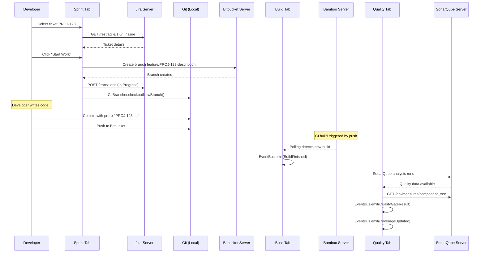
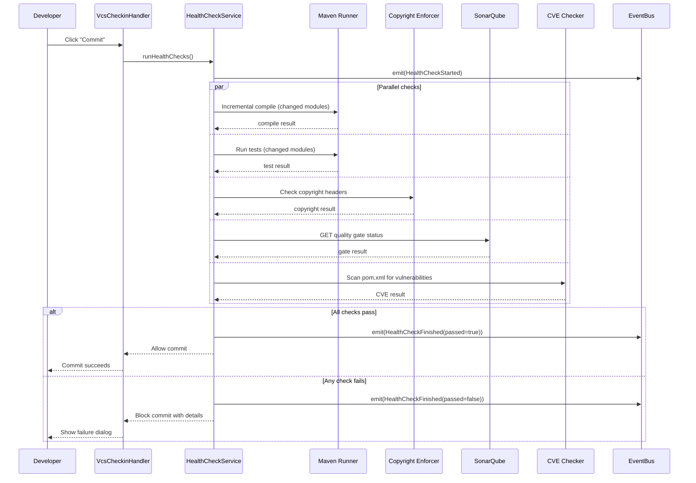
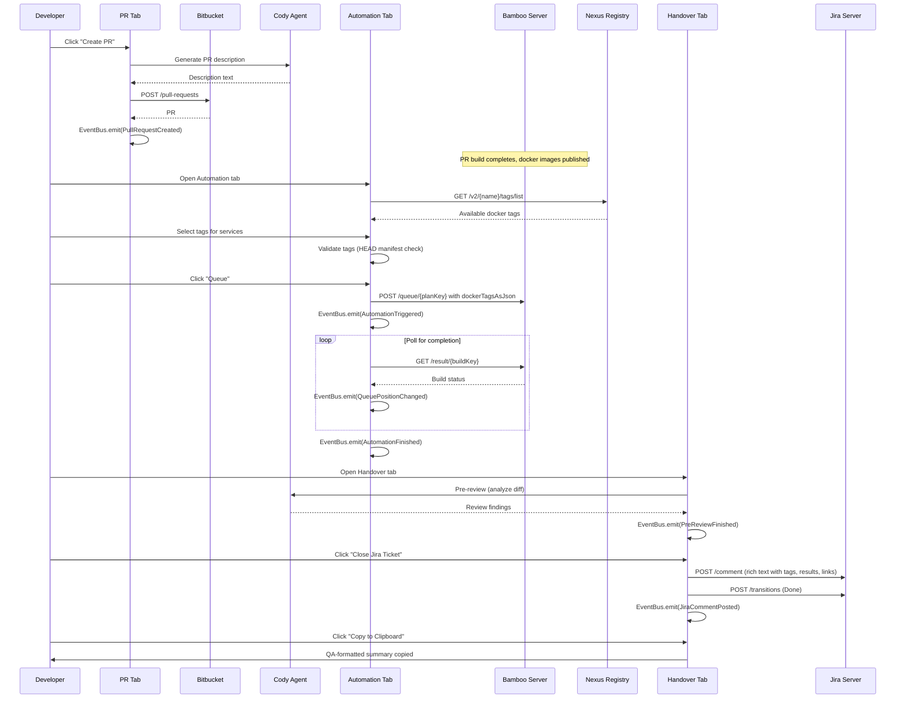
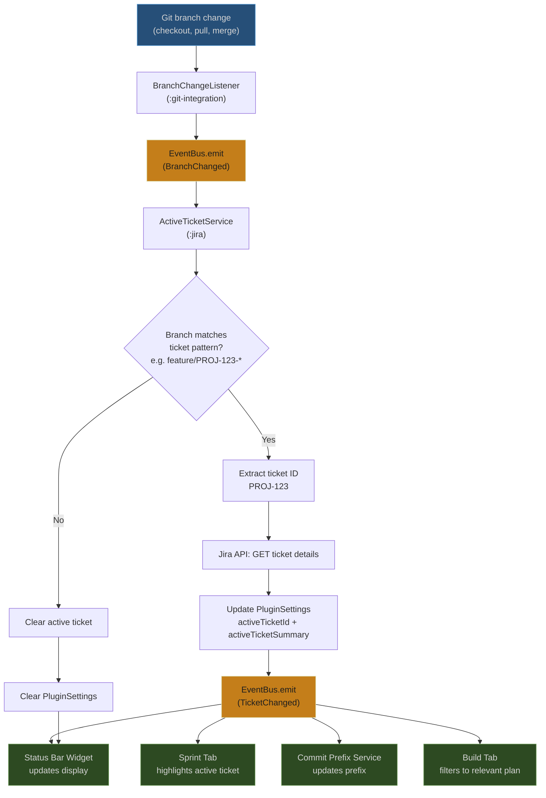
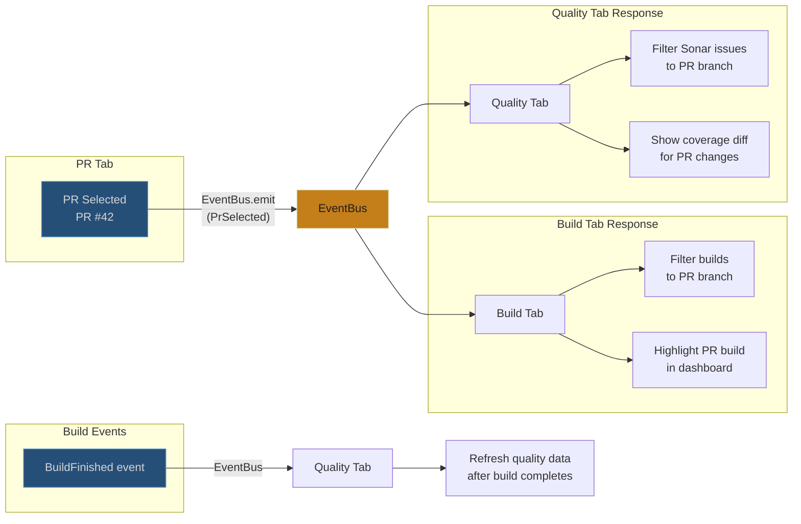

# Data Flow Diagrams

## 1. Ticket to Build to Quality (Daily Developer Loop)

The core workflow: pick a ticket, write code, push, wait for build, check quality.

## 2. Cody AI Augmentation Flow

How the Cody CLI agent integrates with fix actions, commit messages, and PR descriptions.

```mermaid
sequenceDiagram
    participant Dev as Developer
    participant IDE as IntelliJ Editor
    participant Cody as Cody CLI Agent
    participant SG as Sourcegraph Server

    Note over IDE,Cody: Agent startup (JSON-RPC over stdio)
    IDE->>Cody: initialize(ClientInfo)
    Cody->>SG: Authenticate with access token
    SG-->>Cody: Auth confirmed
    IDE->>Cody: initialized(null)

    rect rgb(40, 60, 40)
    Note over Dev,SG: Fix with Cody (gutter action)
    Dev->>IDE: Click "Fix with Cody" on Sonar issue
    IDE->>IDE: CodyEditService builds fix instruction
    IDE->>Cody: chat/submitMessage(fix instruction + file context)
    Cody->>SG: LLM request with file context
    SG-->>Cody: Generated fix (code in response)
    Cody-->>IDE: Chat response with fixed code
    IDE->>IDE: Parse code from response
    IDE->>IDE: WriteCommandAction.runWriteCommandAction(apply fix)
    IDE->>Dev: Show diff preview
    Dev->>IDE: Accept/reject change
    IDE->>IDE: EventBus.emit(CodyEditReady)
    end

    rect rgb(40, 40, 60)
    Note over Dev,SG: Commit message generation
    Dev->>IDE: Open commit dialog
    IDE->>IDE: Collect git diff + active ticket
    IDE->>Cody: chat/submitMessage(diff + context)
    Cody->>SG: LLM request
    SG-->>Cody: Generated commit message
    Cody-->>IDE: Structured message response
    IDE->>Dev: Pre-fill commit message
    end

    rect rgb(60, 40, 40)
    Note over Dev,SG: PR description generation
    Dev->>IDE: Create PR action
    IDE->>IDE: Collect all commits + diff
    IDE->>Cody: chat/submitMessage(commits + diff)
    Cody->>SG: LLM request
    SG-->>Cody: Generated PR description
    IDE->>Dev: Pre-fill PR description field
    end
```

## 3. Health Check to Commit Flow (Pre-Commit Gates)

The sequence of checks that run before a commit is allowed.

## 4. Automation Queue to PR to Handover Flow

The end-of-task flow: create PR, run automation, close Jira, hand over to QA.

## 5. Branch Change to Active Ticket Sync Flow

How switching branches automatically updates the active ticket across the plugin.

## 6. Cross-Tab Branch Awareness Flow

How PR selection propagates context to Quality and Build tabs.

