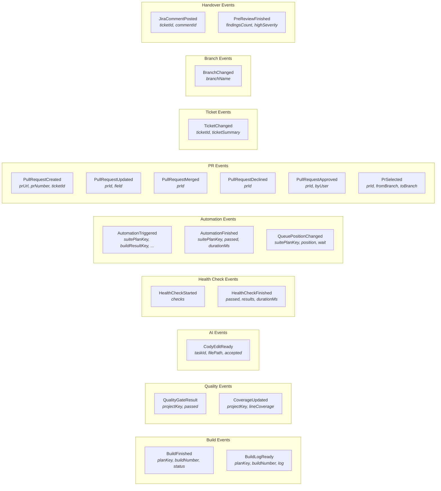
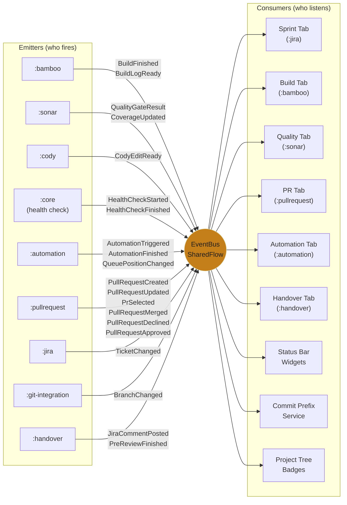

# Event Bus Architecture

## Overview

The `EventBus` is a project-level service in `:core` backed by a Kotlin `MutableSharedFlow<WorkflowEvent>` with zero replay and a 64-element buffer. It is the sole mechanism for cross-module communication -- feature modules never import from each other.

```kotlin
@Service(Service.Level.PROJECT)
class EventBus {
    private val _events = MutableSharedFlow<WorkflowEvent>(
        replay = 0,
        extraBufferCapacity = 64
    )
    val events: SharedFlow<WorkflowEvent> = _events.asSharedFlow()

    suspend fun emit(event: WorkflowEvent) { _events.emit(event) }
}
```

## All 21 WorkflowEvent Types



## Event Flow: Emitters and Consumers



## Event Subscription Matrix

| Event | Emitted By | Consumed By |
|---|---|---|
| `BuildFinished` | `:bamboo` (BuildMonitorService) | Build Tab, Quality Tab, Status Bar, Project Tree |
| `BuildLogReady` | `:bamboo` (BuildMonitorService) | Build Tab (log viewer) |
| `QualityGateResult` | `:sonar` (SonarService refresh) | Quality Tab, Status Bar, Handover Tab |
| `CoverageUpdated` | `:sonar` (SonarService refresh) | Quality Tab, Editor Gutter |
| `CodyEditReady` | `:cody` (Agent callback) | Editor (apply/reject UI) |
| `HealthCheckStarted` | `:core` (HealthCheckService) | Status Bar (progress indicator) |
| `HealthCheckFinished` | `:core` (HealthCheckService) | VcsCheckinHandler (gate result) |
| `AutomationTriggered` | `:automation` (queue trigger) | Automation Tab, Status Bar |
| `AutomationFinished` | `:automation` (poll result) | Automation Tab, Handover Tab, Status Bar |
| `QueuePositionChanged` | `:automation` (poll update) | Automation Tab, Status Bar |
| `PullRequestCreated` | `:pullrequest` (PR creation) | PR Tab, Handover Tab, Status Bar |
| `PullRequestUpdated` | `:pullrequest` (PR edit) | PR Tab |
| `PullRequestMerged` | `:pullrequest` (PR poll) | PR Tab, Jira (auto-close), Status Bar |
| `PullRequestDeclined` | `:pullrequest` (PR poll) | PR Tab, Status Bar |
| `PullRequestApproved` | `:pullrequest` (PR poll) | PR Tab |
| `PrSelected` | `:pullrequest` (user click) | Quality Tab, Build Tab |
| `TicketChanged` | `:jira` (Start Work / branch sync) | Sprint Tab, Status Bar, Commit Prefix, Build Tab |
| `BranchChanged` | `:git-integration` (BranchChangeListener) | ActiveTicketService, PR Tab, Build Tab |
| `JiraCommentPosted` | `:handover` (closure comment) | Handover Tab (completion state) |
| `PreReviewFinished` | `:handover` (Cody review) | Handover Tab (findings display) |
