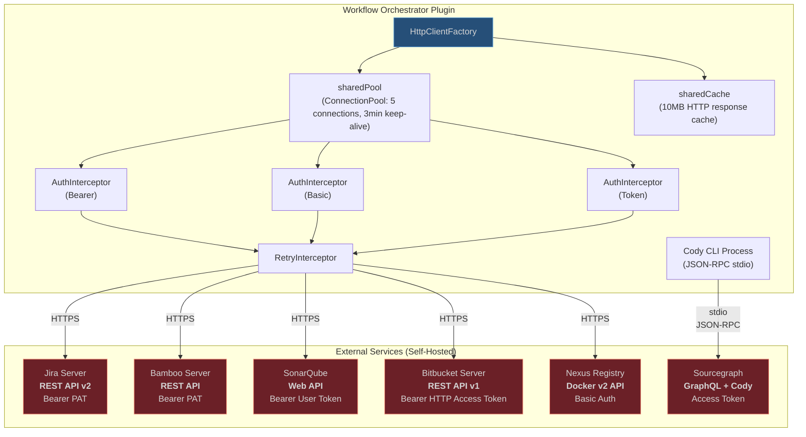
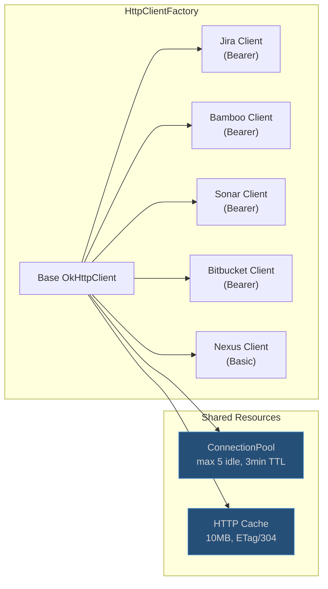

# External API Integration

## Service Overview

## Authentication Methods

| Service | Auth Type | Header / Mechanism | Token Storage |
|---|---|---|---|
| Jira Server | Bearer PAT | `Authorization: Bearer <PAT>` | PasswordSafe |
| Bamboo Server | Bearer PAT | `Authorization: Bearer <PAT>` | PasswordSafe |
| SonarQube | Bearer User Token | `Authorization: Bearer <user-token>` | PasswordSafe |
| Bitbucket Server | Bearer HTTP Access Token | `Authorization: Bearer <token>` | PasswordSafe |
| Nexus Registry | Basic Auth | `Authorization: Basic <base64(token:)>` | PasswordSafe |
| Sourcegraph / Cody | Access Token | Passed in `ExtensionConfiguration.accessToken` via JSON-RPC | PasswordSafe |

All tokens are stored in `PasswordSafe` (OS keychain on macOS, Credential Manager on Windows). They are **never** persisted in XML settings files.

## Connection Pooling

All per-service clients are created via `OkHttpClient.newBuilder()` from the shared base, inheriting the connection pool and cache. Only the `AuthInterceptor` differs (Bearer vs Basic).

## Key Endpoints by Service

### Jira Server (REST API v2)

| Method | Endpoint | Used For |
|---|---|---|
| `GET` | `/rest/api/2/myself` | Test connection |
| `GET` | `/rest/agile/1.0/board/{boardId}/sprint/{sprintId}/issue` | Sprint tickets |
| `GET` | `/rest/api/2/issue/{key}?expand=issuelinks` | Ticket details |
| `POST` | `/rest/api/2/issue/{key}/transitions` | Transition status |
| `POST` | `/rest/api/2/issue/{key}/comment` | Add comment |
| `POST` | `/rest/api/2/issue/{key}/worklog` | Log time |

### Bamboo Server (REST API)

| Method | Endpoint | Used For |
|---|---|---|
| `GET` | `/rest/api/latest/currentUser` | Test connection |
| `GET` | `/rest/api/latest/result/{planKey}/latest` | Latest build |
| `GET` | `/rest/api/latest/result/{buildKey}` | Specific build + stages |
| `GET` | `/rest/api/latest/result/{buildKey}/log` | Build log |
| `POST` | `/rest/api/latest/queue/{planKey}` | Trigger build |

### SonarQube (Web API)

| Method | Endpoint | Used For |
|---|---|---|
| `GET` | `/api/authentication/validate` | Test connection |
| `GET` | `/api/measures/component_tree?component={key}&metricKeys=...` | Coverage data |
| `GET` | `/api/issues/search?componentKeys={key}&resolved=false` | Open issues |
| `GET` | `/api/qualitygates/project_status?projectKey={key}` | Quality gate |

### Bitbucket Server (REST API v1)

| Method | Endpoint | Used For |
|---|---|---|
| `GET` | `/rest/api/1.0/users` | Test connection |
| `POST` | `/rest/api/1.0/projects/{proj}/repos/{repo}/pull-requests` | Create PR |

### Nexus Docker Registry (Docker v2 API)

| Method | Endpoint | Used For |
|---|---|---|
| `GET` | `/v2/` | Test connection |
| `GET` | `/v2/{name}/tags/list` | List docker tags |
| `HEAD` | `/v2/{name}/manifests/{tag}` | Validate tag exists |

### Cody Enterprise (JSON-RPC over stdio)

| Direction | Method | Used For |
|---|---|---|
| Plugin to Agent | `initialize` | Auth + capabilities setup |
| Plugin to Agent | `initialized` | Post-init notification |
| Plugin to Agent | `chat/new` | Create chat session |
| Plugin to Agent | `chat/submitMessage` | Send message (commit msg, PR desc) |
| Plugin to Agent | `editCommands/code` | "Fix with Cody" edits |
| Plugin to Agent | `editTask/accept` | Accept AI edit |
| Plugin to Agent | `editTask/undo` | Reject AI edit |
| Plugin to Agent | `shutdown` | Graceful shutdown |
| Agent to Plugin | `workspace/edit` | Apply file edits |
| Agent to Plugin | `secrets/get` | Request stored credentials |
