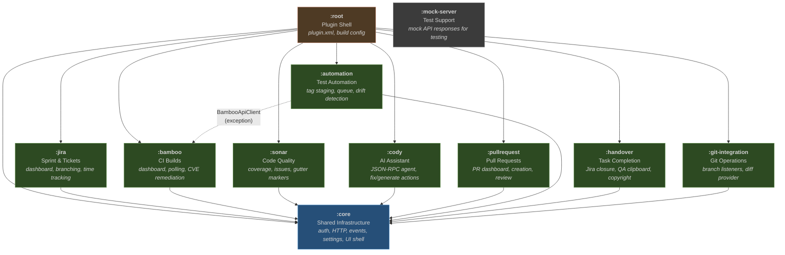
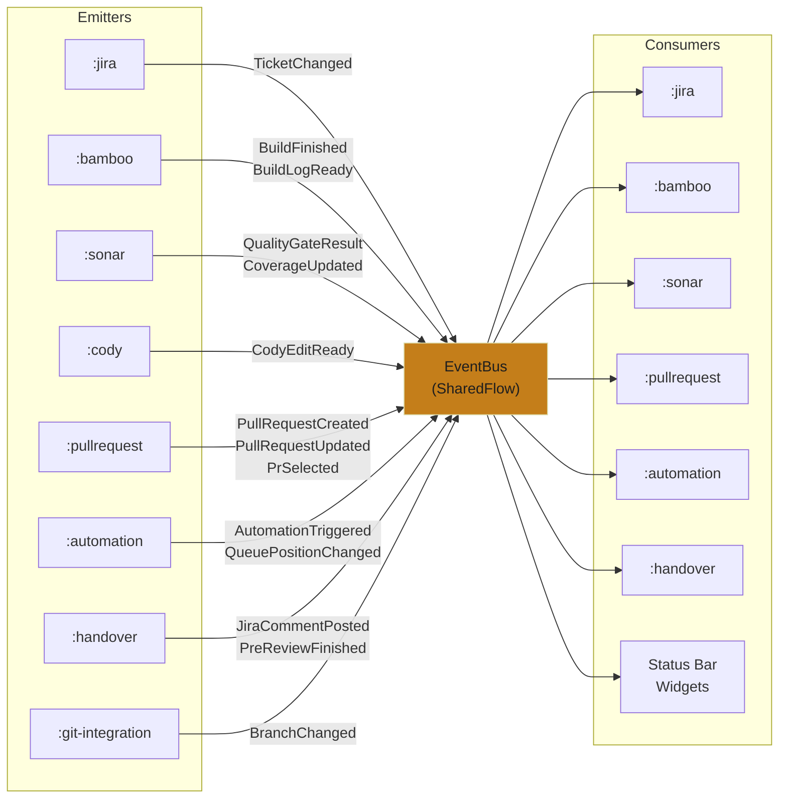

# Module Structure

## Module Dependency Diagram



## Module Responsibilities

| Module | Responsibility |
|---|---|
| `:core` | Shared infrastructure: authentication, HTTP client factory, event bus, plugin settings, tool window shell, onboarding, notifications, and service interfaces |
| `:jira` | Sprint dashboard (scrum + kanban), Start Work flow, branch creation, commit prefix injection, time tracking, and Jira ticket operations |
| `:bamboo` | Build dashboard with stage list and log viewer, background build polling, build status bar widget, project tree badges, and CVE remediation |
| `:sonar` | Quality tab (overview, issues, coverage), severity-coded gutter markers, ExternalAnnotator for inline warnings, editor banners, and coverage badges |
| `:cody` | Standalone Cody CLI agent (JSON-RPC over stdio), "Fix with Cody" gutter action, test generation, commit message generation, and PR description generation |
| `:pullrequest` | PR dashboard with list and detail views, PR creation via Bitbucket API, and PR status tracking |
| `:automation` | Docker tag staging panel, tag validation via Nexus Registry API, drift detector, conflict detector, smart queue with auto-trigger, and config persistence |
| `:handover` | Jira rich-text closure comment, Cody pre-review, copyright fix panel, time log dialog, and QA clipboard (formatted copy for email/Slack) |
| `:git-integration` | Git branch change listeners, diff provider, and branch-to-ticket resolution |
| `:mock-server` | Mock API server for integration testing |

## Dependency Rules

### Primary Rule
**Feature modules depend ONLY on `:core`, never on each other.**

All cross-module communication flows through the `EventBus` (a Kotlin `SharedFlow` in `:core`). If module A needs to react to something in module B, module B emits a `WorkflowEvent` and module A subscribes.

### Known Exception
`:automation` depends on `:bamboo` because it needs `BambooApiClient` to trigger automation suite builds and query build results. This is a deliberate trade-off to avoid duplicating the Bamboo HTTP client.

### Module Layering
Every feature module follows a consistent internal structure:

```
module/
  api/        -- HTTP client + DTOs (kotlinx.serialization)
  service/    -- Business logic (suspend functions, testable with mocks)
  ui/         -- Tool window panels, actions, gutter icons (IntelliJ UI DSL v2)
  listeners/  -- IDE event listeners (lightweight, delegate to services)
```

## Extension Points

The plugin defines 5 custom extension points in `:core` for modular tab and feature registration:

| Extension Point | Interface | Purpose |
|---|---|---|
| `com.workflow.orchestrator.tabProvider` | `WorkflowTabProvider` | Register tool window tabs from feature modules (Sprint, Build, PR, Quality, Automation, Handover) |
| `com.workflow.orchestrator.connectionTester` | `ConnectionTester` | Register per-service connection test implementations (Jira, Bamboo, SonarQube, Bitbucket, Nexus, Cody) |
| `com.workflow.orchestrator.healthCheck` | `HealthCheckContributor` | Register health check steps (Maven compile, tests, copyright, Sonar gate, CVE) |
| `com.workflow.orchestrator.statusBarWidget` | `WorkflowWidgetProvider` | Register status bar widgets (ticket, build, queue) |
| `com.workflow.orchestrator.settingsContributor` | `SettingsContributor` | Register settings sub-pages from feature modules |

All extension points are declared in `:core`'s `plugin.xml` and implemented by feature modules in their respective `plugin-*.xml` configuration files.

## Cross-Module Communication


