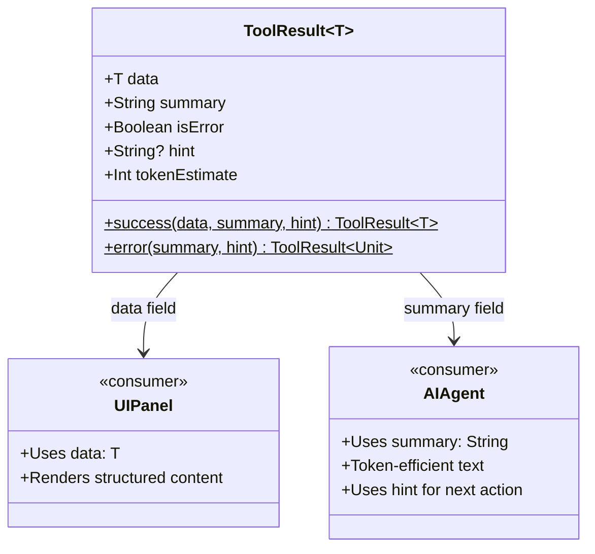
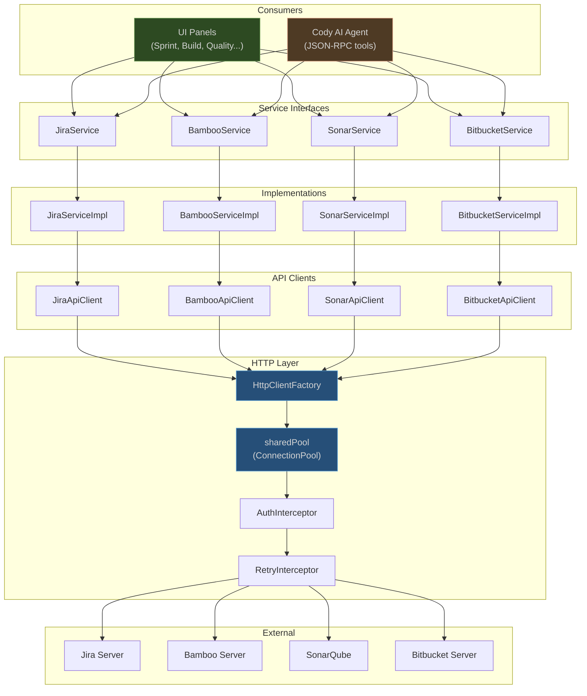
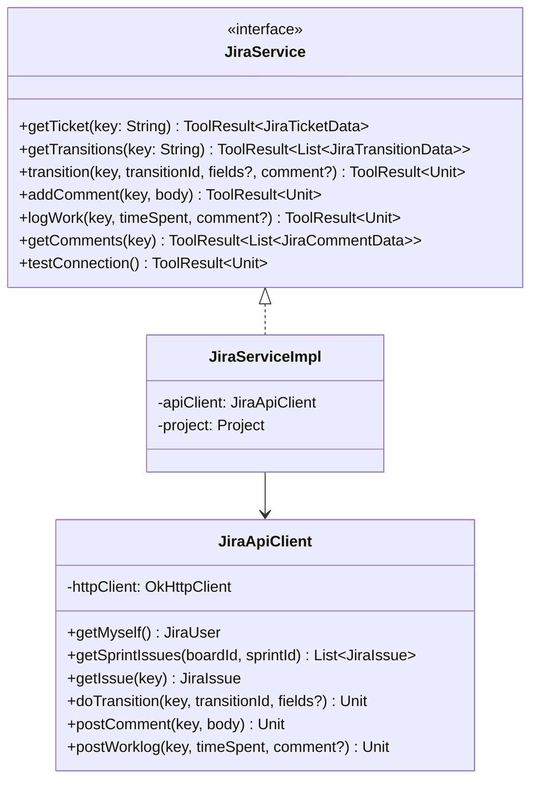
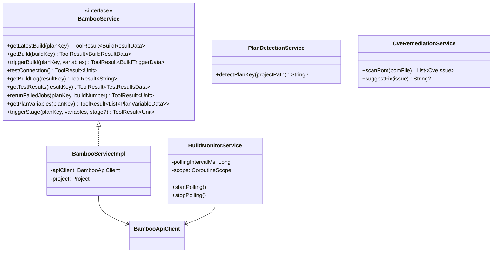
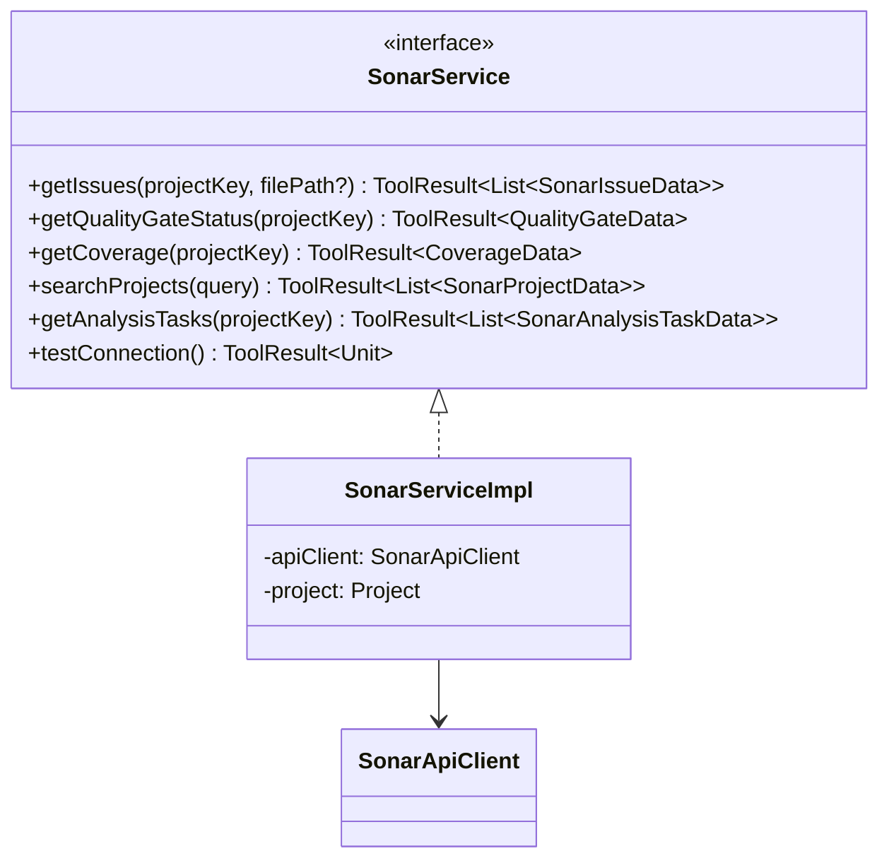
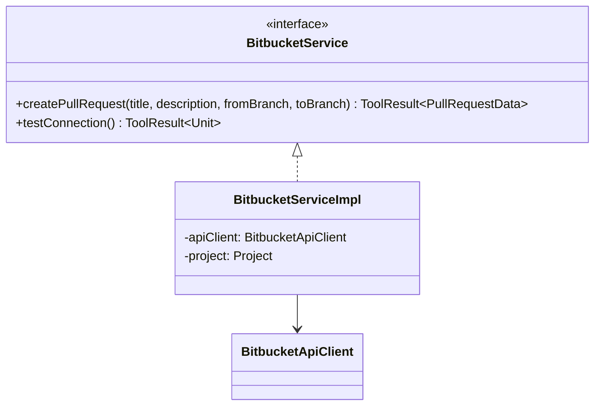

# Service Layer Architecture

## The ToolResult Pattern

Every service method returns `ToolResult<T>` -- a dual-purpose result type that serves both UI panels and the AI agent from the same service call.

## Unified Service Architecture

The same service interface is consumed by both the UI layer and the AI agent. This ensures consistency -- the AI agent and the human developer see the same data.

## Service Interfaces

### JiraService (`:core`, implemented by `:jira`)

### BambooService (`:core`, implemented by `:bamboo`)

### SonarService (`:core`, implemented by `:sonar`)

### BitbucketService (`:core`, implemented by `:pullrequest`)

## Additional Module Services

These services are internal to their modules (not defined as interfaces in `:core`):

| Module | Service | Responsibility |
|---|---|---|
| `:jira` | `SprintService` | Fetch sprint tickets, filter by assignee, board type handling |
| `:jira` | `ActiveTicketService` | Resolve branch name to ticket ID, manage active ticket state |
| `:jira` | `BranchingService` | Generate branch names, create branches on Bitbucket + local |
| `:jira` | `CommitPrefixService` | Inject ticket ID prefix into commit messages |
| `:bamboo` | `BuildMonitorService` | Background polling for build status changes |
| `:bamboo` | `PlanDetectionService` | Auto-detect Bamboo plan key from project structure |
| `:bamboo` | `CveRemediationService` | Scan pom.xml for CVEs, suggest version bumps |
| `:pullrequest` | `PrListService` | Fetch and filter user's pull requests |
| `:pullrequest` | `PrDetailService` | Fetch PR details, diff, activities, and changed files |
| `:pullrequest` | `PrActionService` | Merge, approve, decline, and update PRs |
| `:cody` | `CodyAgentManager` | Manage Cody CLI process lifecycle (start, shutdown, reconnect) |
| `:cody` | `CodyContextService` | Build context items (file ranges, Spring beans, endpoints) |
| `:cody` | `CodyChatService` | Chat session management, commit message and PR description generation |
| `:cody` | `CodyEditService` | "Fix with Cody" edits, test generation, code-to-chat fix flow |
| `:automation` | `QueueService` | Smart queue management, position tracking, auto-trigger |
| `:automation` | `TagBuilderService` | Build dockerTagsAsJson payload from tag selections |
| `:automation` | `DriftDetectorService` | Detect tag version drift between services |
| `:automation` | `ConflictDetectorService` | Detect conflicting tag selections |
| `:sonar` | `SonarDataService` | Cache and refresh Sonar data (issues, coverage, quality gate) |
| `:handover` | `HandoverStateService` | Aggregate handover context (ticket, branch, PR, build, quality) |
| `:handover` | `CopyrightFixService` | Detect and fix copyright header violations |
| `:handover` | `PreReviewService` | Run Cody pre-review on diff before PR |
| `:handover` | `JiraClosureService` | Build rich-text Jira closure comment with docker tags and test results |
| `:handover` | `TimeTrackingService` | Worklog dialog and time logging to Jira |
| `:handover` | `QaClipboardService` | Format QA handover summary for clipboard copy |
