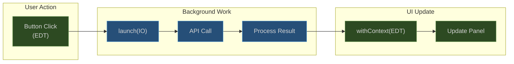

# Threading Model

## Overview

IntelliJ IDEA enforces strict threading rules. Violating them causes either UI freezes (blocking the EDT) or exceptions (writing from a background thread). The plugin uses three execution contexts.

## Thread Context Diagram

```mermaid
flowchart TD
    subgraph EDT ["EDT (Event Dispatch Thread)"]
        direction TB
        UI_UPDATE["UI Updates<br/><i>panel.repaint(), model.fireChanged()</i>"]
        WRITE_ACTION["Write Actions<br/><i>WriteCommandAction.runWriteCommandAction()</i>"]
        SWING_CB["Swing Callbacks<br/><i>button.addActionListener, list selection</i>"]
        ACTION["AnAction.actionPerformed()"]
    end

    subgraph IO ["Dispatchers.IO"]
        direction TB
        API_CALL["API Calls<br/><i>suspend fun getTicket(), triggerBuild()</i>"]
        FILE_READ["File I/O<br/><i>read fixtures, parse logs</i>"]
        HTTP["HTTP Requests<br/><i>OkHttp execute()</i>"]
    end

    subgraph BG ["Background Thread Pool"]
        direction TB
        POLLING["Build Polling<br/><i>service-injected cs.launch(IO)</i>"]
        HEALTH["Health Check<br/><i>runBackgroundableTask</i>"]
        MAVEN_RUN["Maven Build<br/><i>MavenRunner.run()</i>"]
        CODY_AGENT["Cody CLI Process<br/><i>JSON-RPC stdio reader</i>"]
        AGENT_LOOP["Agent ReAct Loop<br/><i>SingleAgentSession + WorkerSession</i>"]
        AGENT_LLM["Agent LLM Calls<br/><i>SourcegraphChatClient</i>"]
    end

    ACTION -->|"launch on IO"| API_CALL
    API_CALL -->|"withContext(EDT)"| UI_UPDATE
    POLLING -->|"withContext(EDT)"| UI_UPDATE
    HEALTH -->|"withContext(EDT)"| UI_UPDATE
    API_CALL -->|"WriteCommandAction"| WRITE_ACTION

    style EDT fill:#2d4a22,stroke:#6a9955,color:#d4d4d4
    style IO fill:#264f78,stroke:#569cd6,color:#d4d4d4
    style BG fill:#4e3a24,stroke:#ce9178,color:#d4d4d4
```



## Rules

### Rule 1: Never Block the EDT

Every API call is a `suspend fun` dispatched on `Dispatchers.IO`. The EDT remains responsive.

```kotlin
// CORRECT
suspend fun loadTickets() = withContext(Dispatchers.IO) {
    val result = jiraService.getTicket("PROJ-123")
    withContext(Dispatchers.EDT) {
        ticketPanel.updateWith(result.data)
    }
}

// WRONG - freezes IDE
fun loadTickets() {
    val result = runBlocking { jiraService.getTicket("PROJ-123") }  // NEVER
    ticketPanel.updateWith(result.data)
}
```

### Rule 2: UI Updates Only on EDT

All Swing component modifications must happen on the EDT.

```kotlin
// CORRECT
withContext(Dispatchers.EDT) {
    tableModel.fireTableDataChanged()
}

// ALTERNATIVE
SwingUtilities.invokeLater {
    tableModel.fireTableDataChanged()
}
```

### Rule 3: Write Actions on EDT

File modifications (applying Cody edits, copyright fixes) require `WriteCommandAction`.

```kotlin
WriteCommandAction.runWriteCommandAction(project) {
    document.replaceString(startOffset, endOffset, newText)
}
```

### Rule 4: User-Triggered Operations Use runBackgroundableTask

Operations like "Test Connection" or "Run Health Check" show a progress indicator.

```kotlin
runBackgroundableTask("Testing connection...", project) {
    val result = service.testConnection()
    invokeLater { showResult(result) }
}
```

### Rule 5: Service-Injected CoroutineScope (2024.1+)

`@Service` classes take `cs: CoroutineScope` as a constructor parameter; the platform owns the scope's lifecycle and cancels it on project (or application) close. Do not allocate `CoroutineScope(SupervisorJob() + …)` inside services.

```kotlin
@Service(Service.Level.PROJECT)
class BuildMonitorService(
    private val project: Project,
    private val cs: CoroutineScope,
) {
    fun startPolling(planKey: String) {
        cs.launch(Dispatchers.IO + CoroutineName("BuildMonitor")) {
            while (isActive) {
                val result = bambooService.getLatestBuild(planKey)
                withContext(Dispatchers.EDT) { updateUI(result) }
                delay(pollingIntervalMs)
            }
        }
    }
}
```

Non-`@Service` classes that fan out fire-and-forget launches (e.g. `AgentController`) keep one field-level `controllerScope` cancelled in `dispose()` and route every launch through it.

### Rule 6: `runBlocking` Policy

`runBlocking` is forbidden on EDT and forbidden inside JCEF bridge handlers (`JBCefJSQuery.Handler` runs on EDT). On background threads (`Task.Backgroundable.run`, `executeOnPooledThread`, `runBackgroundableTask`, `ExternalAnnotator.doAnnotate`, `SearchEverywhereContributor.fetchWeightedElements`), use `runBlockingCancellable { … }` so a `ProgressIndicator` cancel propagates into the coroutine.

## Read Actions

`ReadAction.compute / ReadAction.run / runReadAction` are deprecated for IntelliJ Platform 2026.1 (non-cancellable: a user edit mid-read must wait for the read to complete). Pick the correct 2024.1+ API:

| API | When to use |
|---|---|
| `readAction { … }` | Default from suspend code. Cancellable: yields to a pending write. |
| `smartReadAction(project) { … }` | When the read needs the indexing engine (PSI short names cache, stub index, references). Suspends until indexing finishes. |
| `readActionBlocking { … }` | Write-priority blocking read from a suspend context. Use for short EDT-affine reads (active editor, caret) wrapped in `withContext(Dispatchers.EDT) { … }`. |
| `runReadAction { }` | **Last resort.** Only for non-suspend EDT call sites where no migration target fits (e.g. inside a Swing `MouseAdapter`). Deprecated by the platform for 2026.1. |

```kotlin
// Default suspend pattern
suspend fun classifyChanges(files: List<VirtualFile>): Classification = readAction {
    files.map { it.toPsiFile()?.classify() }
}

// Index-required read
val candidates = smartReadAction(project) {
    PsiShortNamesCache.getInstance(project).getClassesByName(name, scope)
}

// EDT-affine read driven from a suspend context
withContext(Dispatchers.EDT) {
    readActionBlocking {
        FileEditorManager.getInstance(project).selectedTextEditor?.caretModel?.offset
    }
}
```

Two intentional `runReadAction { }` survivors are documented in code with a TODO for the 2026.1 platform bump:

- `jira/ui/CurrentWorkSection.kt:185` — non-suspend `MouseAdapter` callback inside the Sprint banner.
- `agent/ide/IdeContextDetector.kt:114` — synchronous `@Service.init { }` chain.

Migration history for the 49-site sweep lives in `docs/architecture/phase4-prong-d-grep-plan.md` and `phase4-prong-d-grep-audit.md`.

**Build-cache trap.** A commit that flips a lambda type to or from `suspend` (e.g. `(() -> T)?` → `(suspend () -> T)?`) can leave Gradle's compile-avoidance with stale `Function0` bytecode against the new test compile, producing `NoSuchMethodError` at runtime. Always run such commits with `--no-build-cache` (and `--rerun-tasks` for reused tests). See root `CLAUDE.md` § Rebase.

## Threading Pattern Summary



## SmartPoller

The plugin uses `SmartPoller` (in `:core`) for all background polling (build status, queue position, quality data). It implements activity-aware polling with several optimizations:

### Backoff Strategy
- **Exponential backoff**: Interval multiplied by 1.5x (build polling) or 2x (queue polling) on consecutive unchanged responses
- **Jitter**: +/-10% random jitter on each interval to prevent thundering herd across multiple pollers
- **Maximum interval cap**: Backoff is capped at a configurable maximum (e.g., 60s for builds, 120s for queue)

### Visibility Gating
- **Hidden tab penalty**: When the tool window tab is not visible, polling interval is multiplied by 4x
- **Reset on visibility**: When the tab becomes visible again, the interval resets to the base value and an immediate poll is triggered

### Activity Awareness
- Polls reset to base interval when the user interacts with the relevant tab
- Polling stops entirely when the project is disposed or the IDE is in power-save mode

```kotlin
class SmartPoller(
    private val baseIntervalMs: Long,
    private val backoffMultiplier: Double = 1.5,
    private val maxIntervalMs: Long = 60_000,
    private val hiddenMultiplier: Int = 4,
    private val jitterPercent: Double = 0.10
) {
    fun start(scope: CoroutineScope, poll: suspend () -> Boolean)
    fun resetInterval()
    fun setVisible(visible: Boolean)
    fun stop()
}
```

## Agent Threading Patterns

The `:agent` module introduces additional threading considerations due to the ReAct loop, delegation, and JCEF browser integration.

### Agent ReAct Loop

The core agent loop runs entirely on `Dispatchers.IO` via the platform-injected service scope (`AgentService.cs.launch(Dispatchers.IO)`). Each iteration makes an LLM call and optionally executes a tool.

```kotlin
// SingleAgentSession.execute() — suspend function, max 50 iterations
suspend fun execute(userMessage: String): AgentResult = withContext(Dispatchers.IO) {
    repeat(MAX_ITERATIONS) { iteration ->
        val response = llmClient.chat(messages)  // suspend, IO
        val toolCall = parseToolCall(response)
        if (toolCall != null) {
            val result = toolRegistry.execute(toolCall)  // suspend, IO
            // result fed back into conversation
        }
    }
}
```

### Worker Delegation

`WorkerSession` is a scoped ReAct loop (max 10 iterations) spawned by the `delegate_task` tool. Workers run as child coroutines with parent Job cancellation support -- cancelling the parent `SingleAgentSession` cancels all workers.

### Plan Approval (Non-Blocking)

Plan approval uses `suspendCancellableCoroutine` to pause the agent loop without blocking any thread. The JCEF UI calls the continuation when the user approves or revises.

```kotlin
val approved = suspendCancellableCoroutine<Boolean> { cont ->
    // JCEF bridge callback resumes the coroutine
    showPlanApprovalUI(plan) { userApproved -> cont.resume(userApproved) }
}
```

### Token Reconciliation

Token reconciliation (ContextManager calibrating heuristic estimates with the API's actual `usage.prompt_tokens`) happens synchronously after each LLM response within the same IO coroutine. No additional threading concern.

### LLM-Powered Compression

`compressWithLlm()` is a suspend function that calls the Sourcegraph LLM API to summarize large tool results. Triggered by `BudgetEnforcer` when token usage exceeds the COMPRESS threshold.

### Budget Enforcement Actions

| Threshold | Action | Thread Impact |
|---|---|---|
| COMPRESS | Compress oldest tool results via LLM | Additional IO coroutine for LLM call |
| NUDGE | Inject "wrap up" message into conversation | No thread impact (message append) |
| STRONG_NUDGE | Inject stronger "must finish" message | No thread impact (message append) |
| TERMINATE | Stop the ReAct loop | Coroutine cancellation |

### JCEF Browser Thread

The JCEF chat panel runs its JavaScript on the Chromium browser thread (CEF thread). Communication between Kotlin and JavaScript uses `JBCefJSQuery` callbacks which marshal data to the EDT. This is safe because JCEF handles the thread bridging internally.

## Tool-Window Dispose Cascade

`WorkflowToolWindowFactory` wires `content.setDisposer(panel)` for every tab whose panel is `Disposable`, so `Content.dispose()` cascades into the panel (and `Disposer.register(this, child)` inside dashboards completes the chain into nested panels). Any `@Service` that owns its scope via the 2024.1+ injection pattern is cancelled by the platform on project close — Disposer wiring is for non-service Swing components only.

## Common Anti-Patterns

| Anti-Pattern | Problem | Fix |
|---|---|---|
| `runBlocking` on EDT (or in JCEF bridge handler) | Freezes the IDE | `cs.launch(Dispatchers.EDT) { … }` and call the suspend body directly |
| `runBlocking` on a background thread | Loses `ProgressIndicator` cancellation | `runBlockingCancellable { … }` |
| `Thread.sleep()` on EDT | Freezes the IDE | `delay()` in coroutine |
| `CoroutineScope(SupervisorJob() + …)` field in `@Service` | Lifecycle leak; platform owns service scope | Inject `cs: CoroutineScope` constructor parameter |
| `SwingWorker` | Non-structured concurrency | `cs.launch { }` (service scope) or `controllerScope.launch { }` |
| Direct `Thread()` creation | Unmanaged lifecycle | Coroutine on the service-injected scope |
| `ReadAction.compute / runReadAction` from suspend code | Deprecated 2026.1; non-cancellable | `readAction { }` / `smartReadAction(project) { }` / `readActionBlocking { }` |
| Writing PSI/Document off EDT | `IncorrectOperationException` | `WriteCommandAction` |
| Updating Swing off EDT | Visual glitches, race conditions | `withContext(Dispatchers.EDT)` |
