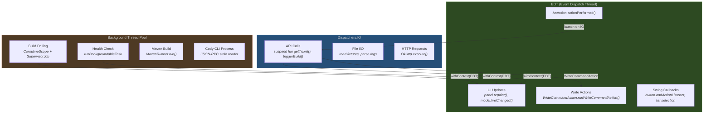
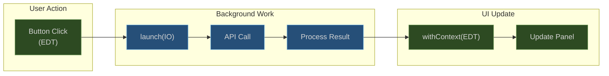

# Threading Model

## Overview

IntelliJ IDEA enforces strict threading rules. Violating them causes either UI freezes (blocking the EDT) or exceptions (writing from a background thread). The plugin uses three execution contexts.

## Thread Context Diagram



## Rules

### Rule 1: Never Block the EDT

Every API call is a `suspend fun` dispatched on `Dispatchers.IO`. The EDT remains responsive.

```kotlin
// CORRECT
suspend fun loadTickets() = withContext(Dispatchers.IO) {
    val result = jiraService.getTicket("PROJ-123")
    withContext(Dispatchers.EDT) {
        ticketPanel.updateWith(result.data)
    }
}

// WRONG - freezes IDE
fun loadTickets() {
    val result = runBlocking { jiraService.getTicket("PROJ-123") }  // NEVER
    ticketPanel.updateWith(result.data)
}
```

### Rule 2: UI Updates Only on EDT

All Swing component modifications must happen on the EDT.

```kotlin
// CORRECT
withContext(Dispatchers.EDT) {
    tableModel.fireTableDataChanged()
}

// ALTERNATIVE
SwingUtilities.invokeLater {
    tableModel.fireTableDataChanged()
}
```

### Rule 3: Write Actions on EDT

File modifications (applying Cody edits, copyright fixes) require `WriteCommandAction`.

```kotlin
WriteCommandAction.runWriteCommandAction(project) {
    document.replaceString(startOffset, endOffset, newText)
}
```

### Rule 4: User-Triggered Operations Use runBackgroundableTask

Operations like "Test Connection" or "Run Health Check" show a progress indicator.

```kotlin
runBackgroundableTask("Testing connection...", project) {
    val result = service.testConnection()
    invokeLater { showResult(result) }
}
```

### Rule 5: Background Polling Uses Supervised CoroutineScope

Long-running polling is tied to the Project lifecycle and uses `SupervisorJob` so one failure does not cancel sibling coroutines.

```kotlin
class BuildMonitorService(project: Project) {
    private val scope = CoroutineScope(
        SupervisorJob() + Dispatchers.IO + CoroutineName("BuildMonitor")
    )

    fun startPolling() {
        scope.launch {
            while (isActive) {
                val result = bambooService.getLatestBuild(planKey)
                withContext(Dispatchers.EDT) { updateUI(result) }
                delay(pollingIntervalMs)
            }
        }
    }
}
```

## Threading Pattern Summary



## Common Anti-Patterns

| Anti-Pattern | Problem | Fix |
|---|---|---|
| `runBlocking` on EDT | Freezes the IDE | Use `launch(Dispatchers.IO)` |
| `Thread.sleep()` on EDT | Freezes the IDE | Use `delay()` in coroutine |
| `SwingWorker` | Non-structured concurrency | Use `CoroutineScope` with `SupervisorJob` |
| Direct `Thread()` creation | Unmanaged lifecycle | Use coroutine scope tied to Project |
| Writing PSI/Document off EDT | `IncorrectOperationException` | Use `WriteCommandAction` |
| Updating Swing off EDT | Visual glitches, race conditions | Use `withContext(Dispatchers.EDT)` |
