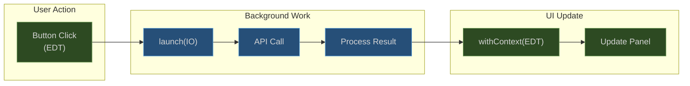

# Threading Model

## Overview

IntelliJ IDEA enforces strict threading rules. Violating them causes either UI freezes (blocking the EDT) or exceptions (writing from a background thread). The plugin uses three execution contexts.

## Thread Context Diagram


## Rules

### Rule 1: Never Block the EDT

Every API call is a `suspend fun` dispatched on `Dispatchers.IO`. The EDT remains responsive.

```kotlin
// CORRECT
suspend fun loadTickets() = withContext(Dispatchers.IO) {
    val result = jiraService.getTicket("PROJ-123")
    withContext(Dispatchers.EDT) {
        ticketPanel.updateWith(result.data)
    }
}

// WRONG - freezes IDE
fun loadTickets() {
    val result = runBlocking { jiraService.getTicket("PROJ-123") }  // NEVER
    ticketPanel.updateWith(result.data)
}
```

### Rule 2: UI Updates Only on EDT

All Swing component modifications must happen on the EDT.

```kotlin
// CORRECT
withContext(Dispatchers.EDT) {
    tableModel.fireTableDataChanged()
}

// ALTERNATIVE
SwingUtilities.invokeLater {
    tableModel.fireTableDataChanged()
}
```

### Rule 3: Write Actions on EDT

File modifications (applying Cody edits, copyright fixes) require `WriteCommandAction`.

```kotlin
WriteCommandAction.runWriteCommandAction(project) {
    document.replaceString(startOffset, endOffset, newText)
}
```

### Rule 4: User-Triggered Operations Use runBackgroundableTask

Operations like "Test Connection" or "Run Health Check" show a progress indicator.

```kotlin
runBackgroundableTask("Testing connection...", project) {
    val result = service.testConnection()
    invokeLater { showResult(result) }
}
```

### Rule 5: Background Polling Uses Supervised CoroutineScope

Long-running polling is tied to the Project lifecycle and uses `SupervisorJob` so one failure does not cancel sibling coroutines.

```kotlin
class BuildMonitorService(project: Project) {
    private val scope = CoroutineScope(
        SupervisorJob() + Dispatchers.IO + CoroutineName("BuildMonitor")
    )

    fun startPolling() {
        scope.launch {
            while (isActive) {
                val result = bambooService.getLatestBuild(planKey)
                withContext(Dispatchers.EDT) { updateUI(result) }
                delay(pollingIntervalMs)
            }
        }
    }
}
```

## Threading Pattern Summary



## SmartPoller

The plugin uses `SmartPoller` (in `:core`) for all background polling (build status, queue position, quality data). It implements activity-aware polling with several optimizations:

### Backoff Strategy
- **Exponential backoff**: Interval multiplied by 1.5x (build polling) or 2x (queue polling) on consecutive unchanged responses
- **Jitter**: +/-10% random jitter on each interval to prevent thundering herd across multiple pollers
- **Maximum interval cap**: Backoff is capped at a configurable maximum (e.g., 60s for builds, 120s for queue)

### Visibility Gating
- **Hidden tab penalty**: When the tool window tab is not visible, polling interval is multiplied by 4x
- **Reset on visibility**: When the tab becomes visible again, the interval resets to the base value and an immediate poll is triggered

### Activity Awareness
- Polls reset to base interval when the user interacts with the relevant tab
- Polling stops entirely when the project is disposed or the IDE is in power-save mode

```kotlin
class SmartPoller(
    private val baseIntervalMs: Long,
    private val backoffMultiplier: Double = 1.5,
    private val maxIntervalMs: Long = 60_000,
    private val hiddenMultiplier: Int = 4,
    private val jitterPercent: Double = 0.10
) {
    fun start(scope: CoroutineScope, poll: suspend () -> Boolean)
    fun resetInterval()
    fun setVisible(visible: Boolean)
    fun stop()
}
```

## Agent Threading Patterns

The `:agent` module introduces additional threading considerations due to the ReAct loop, delegation, and JCEF browser integration.

### Agent ReAct Loop

The core agent loop runs entirely on `Dispatchers.IO` via a `CoroutineScope`. Each iteration makes an LLM call and optionally executes a tool.

```kotlin
// SingleAgentSession.execute() — suspend function, max 50 iterations
suspend fun execute(userMessage: String): AgentResult = withContext(Dispatchers.IO) {
    repeat(MAX_ITERATIONS) { iteration ->
        val response = llmClient.chat(messages)  // suspend, IO
        val toolCall = parseToolCall(response)
        if (toolCall != null) {
            val result = toolRegistry.execute(toolCall)  // suspend, IO
            // result fed back into conversation
        }
    }
}
```

### Worker Delegation

`WorkerSession` is a scoped ReAct loop (max 10 iterations) spawned by the `delegate_task` tool. Workers run as child coroutines with parent Job cancellation support -- cancelling the parent `SingleAgentSession` cancels all workers.

### Plan Approval (Non-Blocking)

Plan approval uses `suspendCancellableCoroutine` to pause the agent loop without blocking any thread. The JCEF UI calls the continuation when the user approves or revises.

```kotlin
val approved = suspendCancellableCoroutine<Boolean> { cont ->
    // JCEF bridge callback resumes the coroutine
    showPlanApprovalUI(plan) { userApproved -> cont.resume(userApproved) }
}
```

### Token Reconciliation

Token reconciliation (ContextManager calibrating heuristic estimates with the API's actual `usage.prompt_tokens`) happens synchronously after each LLM response within the same IO coroutine. No additional threading concern.

### LLM-Powered Compression

`compressWithLlm()` is a suspend function that calls the Sourcegraph LLM API to summarize large tool results. Triggered by `BudgetEnforcer` when token usage exceeds the COMPRESS threshold.

### Budget Enforcement Actions

| Threshold | Action | Thread Impact |
|---|---|---|
| COMPRESS | Compress oldest tool results via LLM | Additional IO coroutine for LLM call |
| NUDGE | Inject "wrap up" message into conversation | No thread impact (message append) |
| STRONG_NUDGE | Inject stronger "must finish" message | No thread impact (message append) |
| TERMINATE | Stop the ReAct loop | Coroutine cancellation |

### JCEF Browser Thread

The JCEF chat panel runs its JavaScript on the Chromium browser thread (CEF thread). Communication between Kotlin and JavaScript uses `JBCefJSQuery` callbacks which marshal data to the EDT. This is safe because JCEF handles the thread bridging internally.

## Common Anti-Patterns

| Anti-Pattern | Problem | Fix |
|---|---|---|
| `runBlocking` on EDT | Freezes the IDE | Use `launch(Dispatchers.IO)` |
| `Thread.sleep()` on EDT | Freezes the IDE | Use `delay()` in coroutine |
| `SwingWorker` | Non-structured concurrency | Use `CoroutineScope` with `SupervisorJob` |
| Direct `Thread()` creation | Unmanaged lifecycle | Use coroutine scope tied to Project |
| Writing PSI/Document off EDT | `IncorrectOperationException` | Use `WriteCommandAction` |
| Updating Swing off EDT | Visual glitches, race conditions | Use `withContext(Dispatchers.EDT)` |
