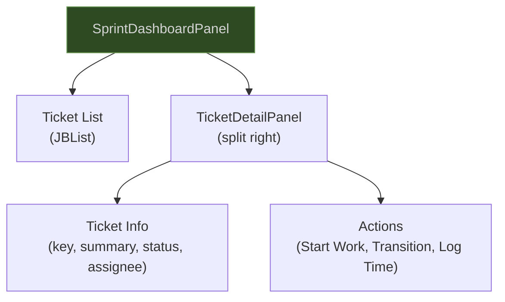
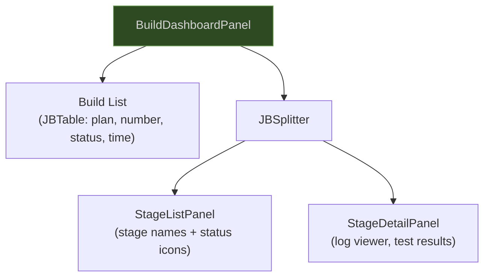
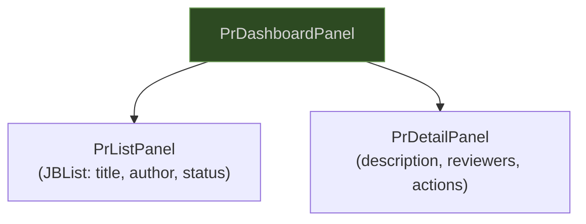
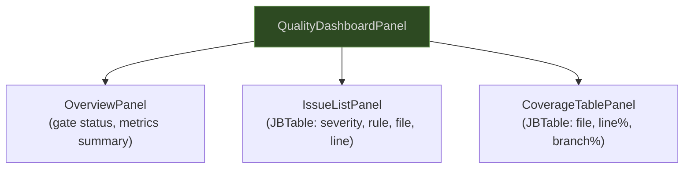
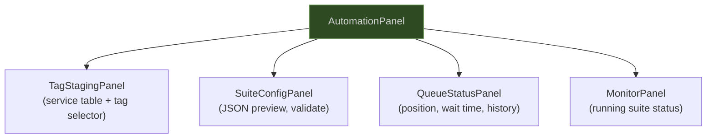
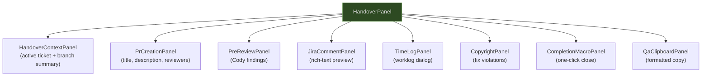
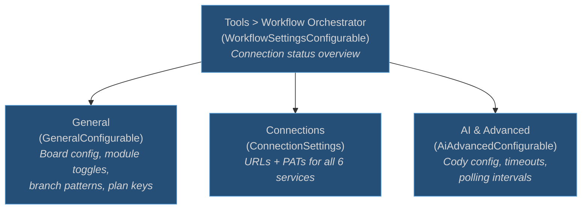
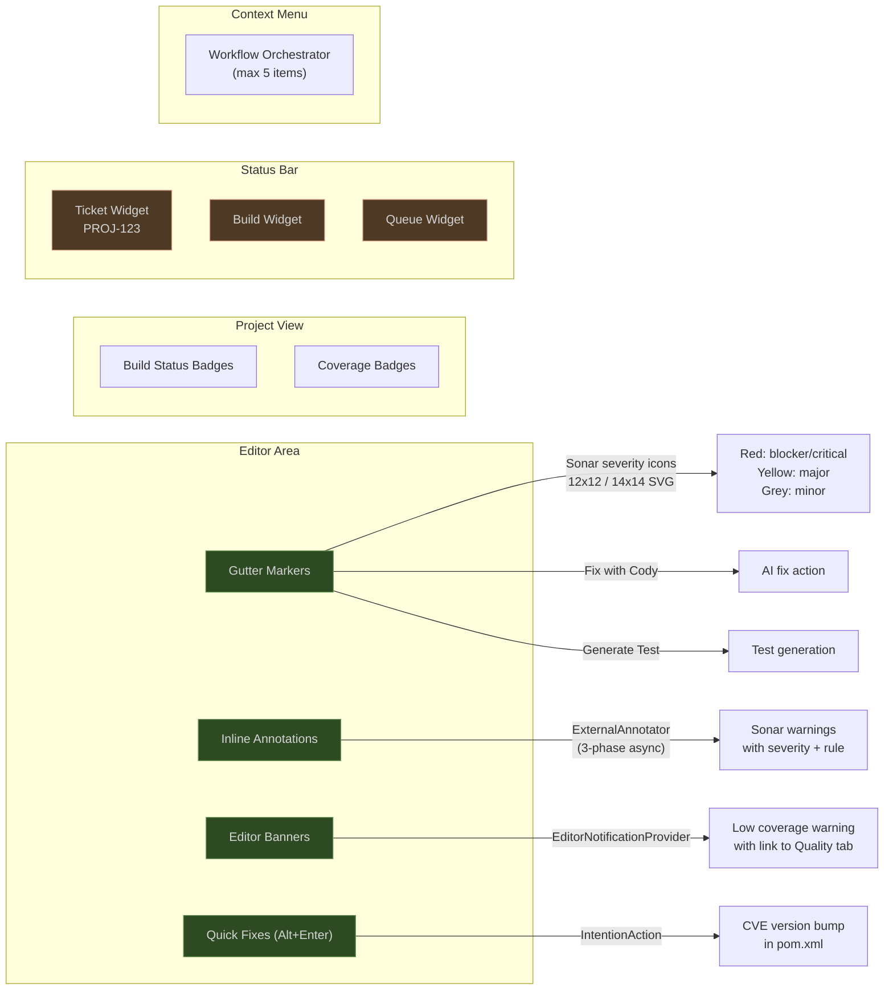

# UI Architecture

## Tool Window Structure

One tool window named "Workflow", bottom-docked, with six tabs. Each tab is contributed by a `WorkflowTabProvider` extension point from its respective module.

```mermaid
graph TD
    TW["Workflow Tool Window<br/>(bottom-docked)"]

    TW --> T1["Sprint Tab<br/>(:jira / SprintTabProvider)"]
    TW --> T2["Build Tab<br/>(:bamboo / BuildTabProvider)"]
    TW --> T3["PR Tab<br/>(:pullrequest / PrTabProvider)"]
    TW --> T4["Quality Tab<br/>(:sonar / QualityTabProvider)"]
    TW --> T5["Automation Tab<br/>(:automation / AutomationTabProvider)"]
    TW --> T6["Handover Tab<br/>(:handover / HandoverTabProvider)"]

    subgraph "Title Bar Actions"
        A1["Refresh"]
        A2["Open in Jira"]
        A3["Settings"]
        A4["Next Tab"]
    end

    subgraph "Gear Menu"
        G1["Settings"]
        G2["Refresh All Tabs"]
        G3["Clear Active Ticket"]
        G4["Open Jira Board"]
        G5["Open SonarQube"]
        G6["Open Bamboo"]
    end

    TW --- A1 & A2 & A3 & A4
    TW --- G1

    style TW fill:#264f78,stroke:#569cd6,color:#d4d4d4
    style T1 fill:#2d4a22,stroke:#6a9955,color:#d4d4d4
    style T2 fill:#2d4a22,stroke:#6a9955,color:#d4d4d4
    style T3 fill:#2d4a22,stroke:#6a9955,color:#d4d4d4
    style T4 fill:#2d4a22,stroke:#6a9955,color:#d4d4d4
    style T5 fill:#2d4a22,stroke:#6a9955,color:#d4d4d4
    style T6 fill:#2d4a22,stroke:#6a9955,color:#d4d4d4
```

## Tab Panel Hierarchies

### Sprint Tab

### Build Tab

### PR Tab

### Quality Tab

### Automation Tab

### Handover Tab

## Settings Pages

## Editor Integration Points

## Empty States

Every tab implements an empty state using `EmptyStatePanel` with a descriptive message and action link:

| Tab | Empty State Message |
|---|---|
| Sprint | "No tickets assigned. Connect to Jira in Settings to get started." |
| Build | "No builds found. Push your changes to trigger a CI build." |
| PR | "No pull requests found. Connect to Bitbucket in Settings." |
| Quality | "No quality data available. Connect to SonarQube in Settings." |
| Automation | "Automation suite not configured. Set up Bamboo in Settings." |
| Handover | "No active task to hand over. Start work on a ticket first." |

## UI Component Rules

- All components use JetBrains variants: `JBList`, `JBTable`, `JBSplitter`, `JBColor`, `JBUI.Borders`
- All icons are SVG with light + dark variants; standard concepts reuse `AllIcons.*`
- Notifications use 4 groups: `workflow.build`, `workflow.quality`, `workflow.queue`, `workflow.automation`
- Maximum 2 action buttons per notification
- Context menu has maximum 5 items, hidden when irrelevant
